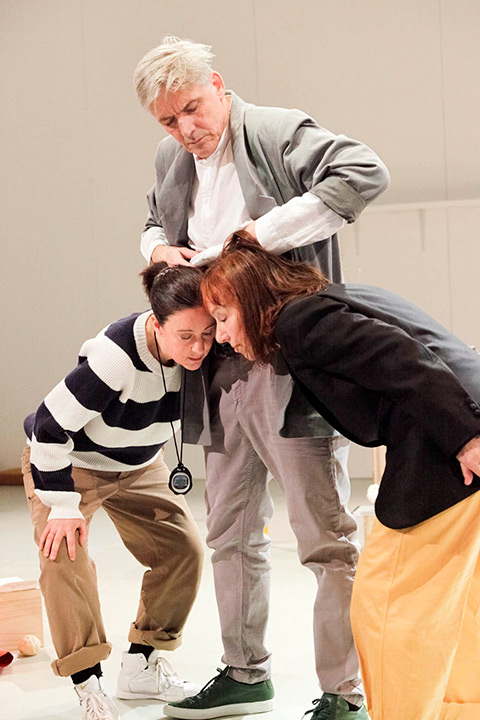
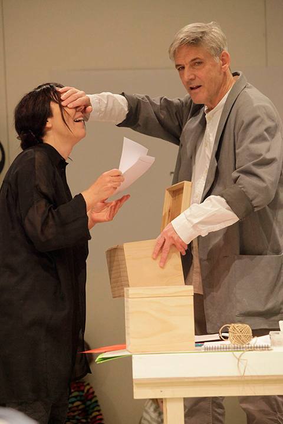
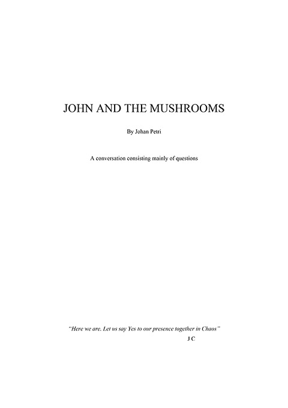

## Entrance
Probably the most inspiring point of entry into what lies ahead would be to first view one of the four documentations of the theater production *John and the Mushrooms*, which this text is going to be about. The experience of doing so will be both slightly confusing and somewhat lackluster since your senses are inevitably disconnected from the live expressive energy of all the many movements and sounds and things that actually took place in the theater space: What can you make from seeing threads being strung like telegraph lines throughout the room, criss-crossing and attached with thoughts, ideas, and mushroom, like messages only just received? Can you possibly make sense of why people in the audience suddenly start to listen to each other’s stomachs? Still, this is what I suggest. Not because I presume that the images and sounds will conjure up anything close to an esthetic experience. But conjoined with this explanatory and critical text it will enable an understanding of an esthetic undertaking. It will put meat on the critical bones and it will hopefully create an effective tension between the unruly development of the performance and the misleading certainty inherent in carefully prepared formulations.

  
  <a href="performances/john-and-the-mushrooms/performance-37" class="media-link">Performance #37</a>
  <a href="performances/john-and-the-mushrooms/performance-50" class="media-link">Performance #50</a>
  <a href="performances/john-and-the-mushrooms/performance-51" class="media-link">Performance #51</a>
  <a href="performances/john-and-the-mushrooms/performance-51" class="media-link">Performance #51</a>

## Introduction one
The intention of this text is to describe how the theater performance of *John and the Mushrooms*, which was produced by and performed at The Royal Dramatic Theater in Stockholm Sweden, 2011, was created. The text is one of three performance descriptions included in this work. However, since the thoughts, methods and esthetics of John Cage are central to this project as a whole, the text expands at certain points into thought lines and areas connected to the questions and points of focus that run throughout the project. Some of those reflective expansions will reoccur in other places, thus taking on the quality of unavoidable critical themes. This is an aspect that needs to be underscored, since it is important to understand that the rendition of Cage’s esthetics that I expose in the following became the substrata for almost every artistic decision made in the processes of creating the performances. In other words, my exposition of the esthetics of John Cage intends to clarify which parts, aspects and thought-lines in Cage’s esthetics that I let myself be influenced by, and how they came to be decisive in formulating the concepts and the structures of all three performances. There is a perpetual oscillating movement that ensues from this, swinging between my personal gaze on Cage’s esthetics and the collective, practical theater work. In these reflections, just as it was in the concrete work of creating the performances, this movement constitutes the main critical force.

What should also be kept in mind is that the in-depth view into the artistic practice of Cage is there, not only to allow for an understanding of the grounds on which different esthetic decisions were made, but – as noted as an overall ambition of this work – it tells about an important aspect in my practice as a director, since it displays how thought processes are built as a core grid for stabilizing the unpredictable and unruly collective process of making theater. Still, would it not be more constructive to begin by telling how the ensemble of *John and the Mushrooms* began to work through all the different questions raised by the encounter with Cage’s esthetics and the different pieces of material? After all, no concept, no theory can hold together in a collective creative process if an understanding of "What are we doing?" and "Why are we doing this?" is not achieved. Why not just try to untangle – and thus illuminate – how different performer problems and esthetic decisions were tackled and made? Let me put it like this. There are certainly theater projects being produced that relate both in method and material to the performance of *John and the Mushrooms*, but even if the collective creative process of the performance is not unique, the specifics around how it was conceptualized, how it was built and performed cannot be understood as a theater practice in general terms. The construction of the concept, the working methods, its deep relation to the thinking and esthetics of Cage, could not be approached without a certain level of explanation. The unconventional demands on the performers had to be introduced slowly, with an emphasis on the force and intention of the concepts. The young, but nevertheless well trained and quite experienced actor Mauritz Elvingsson, commented on this when he said: “The big difference I guess was that we just didn’t know how to do this, how to work, how to come up with what to do. How are we going to rehearse chance? How is that possible? That was probably the biggest problem.” I chose, therefore, to try to mirror the process of creating the concept, as well as the rehearsal process, by laying out the seeds from which it grew. This is done with the hope that the correlation between the esthetic stance of Cage and all the numerous decisions made on the way to creating the performance can be enjoyed.

Followed by an overview of Cage’s artistic practice, esthetic and philosophical thinking, the text goes on to describe how the material for the script was selected, as well as an explication of its structure. Connected to this is a rendering of how we chose and created the material for the different chance- operated parts in the performance. Following a description of the rehearsal process, the text then recounts how the shaping of the performance came about and also how the ensemble collaborated with a reference group. The last part of the text makes an attempt to reflect on how, and to what degree, the work with the performance encouraged a shift in the way we view our different roles in the collective process of making and performing theater.

## Introduction Two

In the fall of 2009 I was invited by the theater department for young audiences at The Royal Dramatic Theater to come up with a suggestion for an original theater production that would work for an audience of all ages, from five years and up. After a series of discussions with the dramaturge at the theater, Irena Krauss, and with my long time collaborator dramaturge Tora von Platen, we decided to create a performance based on music and texts by John Cage. The creative process started, as I remember, with the music. In my habit of surrounding myself with music when working in my studio, I had just been listening intensely to a new recording of Cage’s piece *Thirteen Harmonies* (Cage 1986). Its oneiric atmosphere and broken, but still stable structure stayed with me like an emotional opening, you might say, and led me to listen to some early Cage pieces for prepared piano, totally different in expression, particularly the composition *The Perilous Night* (Cage 1944). Apart from my immediate emotional response to the music, I observed that both of these compositions placed themselves outside historic time. They signaled an artistry that was both old and new: an audacious stance towards history and at the same time feeding off an understanding – and love – for what has passed. It might be that it was this quality that made me think of the music as accessible, in the best sense, and thereby a constructive and playful way to create curiosity for the complexity of the art and thinking of John Cage. Together with an interest in investigating how Cage’s methods and esthetics could be activated in the theater, these two compositions, *Thirteen Harmonies* and *The Perilous Night*, became what could be described as the expressive foundation in the process of creating the performance; when juxtaposed, they revealed a wide and mature emotional landscape, offering structural and compositional stability, as well as flexibility.

Kom ihåg: audio files with Thirteen Harmonies and The Perilous Night

Listening closely to the music of John Cage and working with it intricately was not new to me. I first encountered his music at the music conservatory, and I remember experiencing it as sharp, confusing and emotional all at the same time. As my interest and insights into his music grew, I incorporated it into my work as a record producer and also into my work as a music director for different theater productions. In my innumerable encounters with artists, writers, actors, and even composers, I realized that Cage was a familiar name; however, few had experiences of his music, and even fewer of his writings. So, when I was asked to write and direct a music theater piece for an audience of all ages, I felt intuitively that it was a great opportunity to counteract the uninformed myth and seemingly stubborn picture of John Cage as a “silent” and difficult composer. I saw it as a chance to offer an audience an intimate and playful experience of an artist who many have heard about but few really know. So this was my starting point, to create an opportunity for people to experience the vitality and richness of John Cage’s wide range of musical expression. This initial anticipation was soon going to develop.

When I entered into a deeper reading of the art of John Cage, I found aspects of his thinking and esthetics that, as a theatre director, I felt a strong affiliation with. I will try to describe those connections and begin by making an observation that I think reverberates throughout the performances as well as in these reflections. When studying Cage’s texts, interviews with him and different critical material written about his art, a picture emerges of an artist whose main focus is communication. The question of how art-based communication is created, its quality and form, seems to be absolutely central to his work, both implicitly and explicitly. But communication is complicated, and for Cage it was essential to acknowledge and emphasize the problematic aspects of communication and by doing so to criticize the way we communicate in the culture we live in. He did this both by creating compositions that inspired shifts in the way we listen, but also through applying compositional techniques and compositional forms – scores of instructions engaging the creativity and judgment of the performer in new ways – new to the idiom of contemporary music. These two activities, or tactics, undermine our preconceptions about two things: first, about how music should sound; secondly, how music (i.e. art) should be made. Some of the ideas that John Cage fostered, and with which he was allied, like superimpositions in musical compositions, had been around a long time. Others, he might have thought were “new,” were not. I do not think it was important to him to be the originator of specific ideas. He wanted to make things that were unfamiliar to him, and in comparison with what was going on around him – things that had not been done.21
21  “I am devoted to the principle of originality - not originality in the egoistic sense, but originality in the sense of doing something that it is necessary to do. Now, obviously, the things that it is necessary to do are not the things that have been done, but the ones that have not yet been done. This applies not only to other peoples work, but seriously to my own work. That is to say if I have done something, then I consider it my business not to do that, but to find what must be done next” (Kostelanetz 1987, 207).
 I mention this because it shows that, even though Cage was focused on inventing new compositional tools and new musical forms, his aim was to reshape the role of the composer, the role of the performer and the role of the listener. This shifting, reshaping, re-formulating of the role of the artist in relation to the making of art and to its listener and viewer is, in today’s post-postmodern times, a discourse both central (i.e. important) and dulled by over-use. Art that has provoked and questioned the modernist idea of the solid and admirable artifact made by a “genius”, is an energy that has been around for almost a hundred years.  Cage was certainly not the first, but the vital and enduring impact that his art has made in this respect, can hardly be disputed. In the world of theater, its impact has been alternately acknowledged, and ignored. A number of theater practitioners, like those mentioned in the introductory chapter, have created forms and methods for making theater that resemble those of Cage, but dramaturgical thinking and the role and practice of the director have, to only a limited extent, been effected by this development. This of course applies mainly to what we regard as the mainstream, but even among fringe theater groups the impact of Cage’s sharp reconfiguration of hierarchical structures and authorship are few.22
22 As I mention, there are of course theater practitioners, both within larger institutions and among fringe theater groups, that have assimilated certain aspects of Cage’s esthetics, but the reconfiguration of hierarchical structures and authorship most often is about a redistribution of power, for example moving the authorship from the writer to the actor, making directorial decisions in a collective mode, and so on. Though, what is important to keep in mind, both in the framework of Cage and the performance of *John and the Mushrooms*, is that the multilayered structure of the expression eliminates the role of the narrative, and it reshapes the power relationship between the performance and the audience, as the juxtaposition of every expressional part is made individually by each person and the expressional imprint is radically less in the hands of the performer/performance. The fact that the performers in *John and the Mushrooms* had to make artistic choices while performing, eliminating the directorial influence of the director, is done in a lot of improvisational theater but, as I mentioned, that idiom tightly draws on representational narrative structures and does not aim to reshape the relation between the performance and audience when it comes to creative responsibility. 
 When conceptualizing the production of *John and the Mushrooms*, a central concern was therefore, how to problematize and reshape the different roles involved.

Another concern was to let Cage’s alignment with an anarchic political stance and his encouragement of individual interpretations, influence the dramaturgical thinking. In this I saw a direct link to my interest to formulate my own activities and esthetics in relation to their affect on their surroundings, and to activate this aspect, which I choose to call the political discourse of the performance, was relevant within the framework of *John and the Mushrooms*. It meant connecting the different esthetic choices and formal solutions to discussions about their communicative capacity, to discussions about their effect on the audience and to their inherent political intentions. Since the performance was geared to a young audience, this aspect of relating esthetic choices to a political view took on a specific dynamic and the concept of politics underwent a transformation towards definitions related to questions of a social and ethical nature.

These two aspects: first, the shifting and reconfiguration of the different roles we take on in a theater performance - as audience, as performer, dramatist or director - and, secondly, the merging of an avant-garde esthetics with a social and political engagement, are what the making of *John and the Mushrooms*, as well as this reflective project as a whole, intend to investigate.

Kom ihåg: BILD

## On Cage, his esthetics interpreted

Today, one hundred years after the birth of John Cage and twenty years after his death, the amount of literature and criticism on his art, and its position and influence, is rich and multi-disciplined. Most of it can be referred to as academic literature, in a variety of fields, such as musicology, music theory and history, art theory and history, performance studies, and poetics.23
23 Included examples are Fetterman 1996 (musicology), Kostelanetz 1987 and 1996, Retallack 1996, Bernstein and Hatch 2001 (music theory and history), Perloff and Junkerman 1994, Ekbom 2009 (art theory and history), Fisher-Lichte 2008, Perloff and Dworkin 2009 (performance studies and poetics).

24 David Revill’s approach in his book *The Roaring Silence: John Cage a Life*, from 1992, is very much akin to this wide perspective. In his preface he says: ”the life, work and thought of John Cage form not an assembly of facts but a story with a unifying theme: Cage making himself through ever more adequate ways of transforming internal tendencies into external actions, which clarify the internal in turn. He develops through his activities a self-clarifying line which is almost exclusively ascetic and, emotionally but epistemologically, transcendental.” In the critique of Cage, the importance of a broad perspective is common but the psychodynamic angle indicated by Revill in this quotation, in conjunction with the concept of emotional transcendence, is special and takes on a specific dynamic when put into the framework of the discourse of immanence, purported in this work.

25 As I mention in the foreword, when framing the different esthetic discourses this work relates to, a large number of theater practitioners and groups base their performances on other types of material, such as themes or questions that are researched. This comment should be seen broadly and relating mainly to western institutionalized theaters
 The literature on Cage also extends into areas like theories around the nature of creativity and the relationship between art and spirituality. Sometimes the name Cage turns up within a context one would never have guessed, and I choose to see this as a sign that his doings reverberate far beyond the circles of (contemporary) music and that his thoughts and methods can be transferred and used in many different practices and thought processes. But my view of Cage, his esthetics and methods, is not intended to give an overview of the current status of Cagean criticism. First of all, that would not be possible and second, it would not help us to better understand how the performance of *John and the Mushrooms* was created.

The directorial process of this project can best be described as an undertaking to interpret the whole esthetic world of an artist, rather than staging one specific piece of material.24 I make this observation partly to differentiate from the more common process for a theater director working in the European theater tradition which since the late nineteenth century has most often been about interpreting and staging a play, opera or specific material.25.Another reason for making this comment initially, is to clarify that a certain aspect of directing can be described as the building of a methodology, a tool constructed to be used both for the preparatory part of the process of creating a performance as well as for the collective work during the rehearsals. This may sound like it is possible to create a method *before* encountering the material – the material in the case of Cage being music compositions, texts, different types of documentations, written interviews as well as audio and visual art pieces  – which I do not think is doable. The direct, intuitive and unshielded encounter with the material has to be allowed extensive unstructured time. (I dwell on it, I try to dream it, I move to it, I listen to it, I read it again and again and I play with the idea that I made it myself.)

If interpretation, in the framework of theater directing, is understood as an act of renewal of one specific piece of material, it is necessary in this case to invent another term that encompasses the pursuit of creating a performance based on the whole oeuvre of a writer or composer. The reason for this is that there is a distinct difference between the two endeavors. That difference is a shift towards practice, a shift that means being sensitive not only to the expression of the art, but to the judgment and quality exposed in the act of making it. This can also be seen as a move away from the particular towards the whole, and understood as an ambition to create a performance where the esthetic, ethical and political engagement is reflected more in the structural level than in the explicit semantic level of the performance. It should not be understood as an interpretation but as an *alignment with and an adaption of a practice*. When applying this kind of view to the art of John Cage, the step towards building a “methodology of the project,” becomes unobstructed. I attribute this consequence to the fact that Cage’s compositional process and modes of thought provide resources for structuring unstructured time and that, in his doings, he includes expressions and techniques that guide the affect. More specifically, this can be exemplified in his compositions that are based on text instructions in combination with durational instructions, often with an explanatory text as an introduction. But also in the many different texts in which Cage exposes a concern about the relation between the expression and the perception, i.e. a focus on the affect.

> I think that modern art has turned life into art, and now I think it’s time for life (by life I mean such things as government, the social rules and all those things) to turn the environment and everything into art. In other words, to take care of it, and to change it from being just a mess into being something which facilitates our living, instead of making us all miserable. (Kostelanetz 1987, 212)  

The intention behind creating a “methodology of the project” is to identify what constitutes Cage’s esthetic world, in order to better understand the reasoning leading to the different steps in his compositional practice. This, in turn, creates a picture of a structure – a map – to be used for navigating, in alignment with his practice and artistic intention. In the case of *John and the Mushrooms*, this methodology, or map, was clearly in place when we created the concept for the performance, and even if it partly changed through the collective creative process, its importance was crucial for the work of the performers. Since major parts of the performance included improvisation and the demand on the performers to take artistic responsibilities was taxing, this methodology became an indispensable stabilizing factor. As we shall see, the meaning and essence of “the methodology of the project,” expanded far beyond the performative situation into an understanding of the intent and affect of the expression.

## Interpretation of esthetics I
A deeper understanding of the esthetic world of Cage – along side with my already extensive contact with his music - came through reading. Since the literature and criticism on Cage and his art is extensive and diverse, I decided, before turning to secondary literature, to stay with his own voice. Cage wrote continuously throughout his life: reviews, essays, poetry, short stories, short-short stories and lectures. He also generously expressed himself on the role of the artist and the function of art, in interviews and different public forums. In conjunction with his own writing, which consequently serves as the core reference both in the shaping of the performance, as well as in these reflections, I have mainly referred to two references. Joan Retallack, American writer, poet and scholar gives us important insights in her exposition *Musicage, Cage muses on Words Art Music* (1996), a book constructed around interviews made with Cage during the last two years of his life. After an insightful and condensed foreword, that introduces the reader to Cage, Retallack inserts, as an overture to the interviews, Cage’s own text *Art is Either a Complaint or Do Something Else* (1989).  In one of the passages in her foreword, she manages to encompass both the large setting in which Cage wanted to place his art, as well as to position it in a context beyond contemporary music, when she says that this “work brings material and experiences together in a mode of enactment rather than ‘aboutness’. Patterns of sound and silence, chance and design startlingly reveal their utterly intermingled contingency, not as idea, but as initiating experience to be undergone by composer and audience equally involved in the making of meaning” (Retallack 1996, xxvii). The first interview in the book is conducted in September 1990 and the last interview, or conversations as Retallack chose to call them, takes place on July 30, 1992, only twelve days before Cage died. Retallack steers the conversations in such a way that they encompass both in-depth details about specific compositions and compositional problems as well as reflections on past political events, and thoughts and reflections about the future. These interviews radiate an intimacy which partly emanates from evenly placed reminders of small details in the room where they sit and talk - all five take place in Cage’s kitchen - or sounds coming from the street through an open window, or the purring of the cat. There is also an intimate rhythm to the conversations and a willingness to pull the issues into an emotional dynamic, which might sound strange, since Cage rarely spoke about emotions or his inner private life. But I think it signals a sense of urgency, that both Cage and Retallack exude in their totally fluent and playful yet serious way of talking about art as something important for humans, in the world. The other source, central to this project, is a book with interviews that Richard Kostelanetz made with Cage in the 1980s (Kostelanetz, 1987). Included are not only interviews that Kostelanetz himself conducted, but also interviews done by other people. The book is divided and organized into sections dealing with various themes like Cage’s influences, his music, his writing, esthetics, pedagogy, and social philosophy. To group the material in such a way is maybe obvious, but even so it clearly shows how Cage’s activities had many different focuses.

Both these books portray Cage in an open, not overly reflective way, presenting him rather than analyzing his work. This makes room for other references and critique with more interpretive approaches. Yet, even if this latter group is necessary as a resource for gaining a more complex picture, the handling of these references is tricky. What I mean by that is that many of the critics producing secondary literature on Cage and his oeuvre, emphasize the same aspects and make similar interpretations of his work. This can be taken as a sign that Cage’s activities carry a certain one dimensionality in regards to their intention, but the tricky part of this phenomena is that it can become normative and as such stand in the way for both a deeper understanding and for more eccentric interpretations. Dwelling on this dynamic, what we might call “the myth of Cage” and its negative consequences, is confined to these reflections; it never became disproportionate in the process of making the performance.

## Interpretation of esthetics II

To approach the esthetic world of Cage does not entail any hidden keys or access to some advanced knowledge. It is actually the opposite; the dominant energy and ambition communicated through his texts and the different interviews, is an attempt by Cage to express his ideas and intentions in a way that functions well outside the language and references of contemporary music. I encountered this communicative quality early on in my readings, even before the decision to produce the performance was made, and I came to understand that the basis for Cage’s activities – or doings, as he would say – was to engage in the world. The relationship between life and art, between esthetics and politics, was essential to him. Even in his formulations about the circumstances under which he is doing his doings, he emphasizes the relationship between art, the artist and the world outside. One could therefore say, as I outlined in the introduction, that it is the communicative potential of art that, through his inventions, he investigates and develops.

> I think one of the things that distinguishes music from other arts is that music often requires other people. The performance of music is a public occasion or a social occasion. This brings it about that the performance of a piece of music can be a metaphor of society, of how we want society to be. Though we are not now living in a society which we consider good, we could make a piece of music in which we would be willing to live. I don’t mean that literary, I mean it metaphorically. You can think of the piece of music as a representation of a society in which you would be willing to live. (Retallack 1996, xxx)

In its illustration of how the performance situation offers a model for the relationship between the individual and society, this quotation strongly relates to my own thinking about the theater as a place where unexpected possibilities can be found and experienced. A thinking that, among other things, revolved around the challenge to stage language structures of a broken and non-narrative kind.26
26 This can be exemplified with theater productions based on texts by for example Gertrude Stein, Öyvind Fahlström, Erik Beckman and texts by other poets.  The aspect of “unexpected possibilities” is treated extensively in the text *Meeting-Meaning*.
  Implicitly, Cage’s words criticize the idea of the theater as a place where already known structures of power, relations or emotions are displayed, instead of being a place where unknown capabilities are illuminated. As the choice of which material to perform must be considered the main factor in such an ambition – to vitalize the theater by seeing it as a place for possibilities – it strengthened my idea of creating a piece, at a mainstream theater, based on his music. This short quotation is also a good example of the playful sharpness Cage often used when talking about his views on art and the role of the artist, and as such it set the tone for the working process and the performance as a whole.

Cage’s writings on art, art theory and philosophy are quite extensive, and it is reasonable to say that it is an essential part of his oeuvre. He was often asked about this multidisciplinary practice, moving between composing and writing and visual art, and one can sense a certain impatience when he says: “Some people consider me a poor musician whereas they think some of my ideas are interesting. So they say, he’s not a musician, but he’s a philosopher, whereas most philosophers say he’s not a philosopher but he’s a good musician. And they ask me sometimes which I think are more important – my compositions or my texts, and the answers are the ones we’ve been giving all through this conversation – when we’re writing music, that’s what important, and when we’re writing ideas, that’s what’s interesting” (Kostelanetz 1987, 19). In his often multifaceted and sometimes contradictory views, exposed in his writings and in interviews, an ambition to demystify the role and practice of the artist repeatedly emerges; he proposes that the meaning of art lies in how it can be used. He says: “Everything I do is available for use in the society” (Retallack 1996, xxvii). Cage, inspired by his engagement in Zen Buddhism, asserts the idea of art as a tool for heightened life experience in the concreteness of the present moment and as a place where questions rather than answers should lead the way. It is the effect of the art that is interesting, and this effect should be steered towards increasing the sensitivity of the human mind.27
27 To emphasize that the heightened life experience is connected to the concreteness of the present moment is to clarify that it is not about transcending life.

Looking at the early encounters Cage had with music and juxtaposing those with my own experiences of different temperaments and talents within the field of music making, I would describe Cage’s musical capability as dominated by curiosity and creativity rather than conventional musicality. This impression is fueled by his own reflections on his musical studies as a child, when he describes that he was very early on was more interested in making his own pieces then playing the etudes on the piano. It seems clear that his talent was not weighed down by being a musical *wunderkind* with perfect pitch and fast fingers. Later, when studying with Arnold Schönberg, he was brutally confronted with his lack of a musical ear when told by his teacher that “without a feeling for harmony I would always encounter an obstacle, a wall through which I wouldn’t be able to pass.” And Cage answered: “in that case I would devote my life to beating my head against that wall” (Kostelanetz 1987, 5). A strong self-confidence combined with the gift of playfulness ensured that this lack of a conventional musicality never became an issue for Cage. He was a builder and an inventor who made use of the means he had access to. In his youth, Cage was close to his father who was an inventor and it is tempting to deduce that his father, being an inventor, influenced Cage’s own practice.28
28 Cage seem to have a real love for telling short stories about his father’s different inventions, that almost all failed in one way or the other. “My father invented a submarine just before the First World War which had the world’s record for staying under water, and he dramatized this by making an experimental trip on Friday the thirteenth, with a crew of thirteen, staying under water for thirteen hours. But it never entered his mind that the value of staying underneath water lay in being invisible to people above. Because his engine ran on gasoline it left bubbles on the surface of the water. So his sub wasn’t in the war, and Dad went bankrupt” (Kostelanetz 1987, 23).
  A temptation that is fueled by the fact that he so clearly acknowledged his closeness to his father, but even more so by the sprawling number of examples, both from his early practice as a student, artist and composer up to his later mature years as an artist, that show a very tactile and pragmatic attitude towards art making. When Cage describes the circumstances leading up to experimenting with the prepared piano – maybe the most well known of his musical “inventions” – you sense an energy to find a practical and functioning solution to a problem: “In 1938 Syvilla Fort … asked me to make music for her *Bacchanale*. The space was small, and there was no room for percussion, only room enough for a grand piano. So I had to do something suitable for her on that piano. And that’s what happened. … I went to the kitchen and got a pie plate and put it and a book on the strings and saw that I was going in the right direction. The only problem with the pie plate was that it bounced. So then I got a nail, put it in, and the trouble was it slipped. So it dawned on me to put a wood screw between the strings, and that was just right. Then weather-stripping and so on. Little nuts around the screws, all sorts of things” (Kostelanetz 1987, 58). To a greater or lesser degree this inquisitive attitude can be found in many of Cage’s compositions and combined with his interest in creating close relationships with musicians and other performers, it exposes a strong interest in the technical and hands on aspect of music making.29
29 An example of this could be the piece *Fontana Mix* from 1958, which consists of 6 drawings in conjunction with 10 transparencies. This piece, deriving from notations used in *Concert for Piano and Orchestra* (1957/58), was developed into a tape music composition that Cage used in different transformations in a number of pieces, like Water Walk, which was part of the performance of *John and the Mushrooms*.

30 Cage says: “Everything I have composed since 1952 was written for David Tudor” (1980, 120).

  He developed many in depth dialogues with musicians both in order to understand in detail the specific instruments but also to guide and support their understanding and interpretation of his music. The musician who was perhaps closest to him over the years was the piano player David Tudor, whom Cage repeatedly refers to when reflecting on his own development as a composer.30 Commenting on Tudor’s artistic judgment and capacity as a piano player, in the framework of creating more open scores, he says: "This giving of freedom to the individual performer began to interest me more and more. And given to a musician like David Tudor, of course, it provided results that were extraordinarily beautiful" (Kostelanetz 1987, 67).

Yet another observation by Cage on the practicalities of music making, can serve as a vehicle for further insight into his interest and focus on the tactile aspect of art making, and when approached with a detailed analysis, we can learn a lot - in general - from the following quotation about Cage’s art practice.

> What is to be done is quite marvelous. It’s what we call ‘truckera,’ which is the playing of a record with a hundred pieces of recorded operatic music all superimposed. So that it is like a huge truck of operatic music that passages through the environment. Sometimes going from right to left, sometimes going from left to right, but it has the same effect that a truck would have passing across the rest of the sound. We found that a way of turning the loudspeakers upside down over something like a forty-foot vent that goes into the ground. You know, a grating. And the sound is marvelous. It sounds as though it comes from somewhere else, which it does. But what’s wanted is that as it goes from left to right, that it start from nothing and come into the present and then go back to nothing. Poor Mr. W. can’t do that. But Andy can do it with ease. It means, apparently, starting one speaker and then one more … in other words doing a kind of glissando of speakers, slipping from one to the next, and then letting them slip out at the end. Then you really get the feeling that you want – of starting low, getting very loud, and disappearing. I’m at the point of asking Andy to do it. Just in order to … taste success! (Retallack 1996, 300)

Cage is almost 80 years old when he related this story to Joan Retallack, about working with Andrew Carver on a version of *Europea 5* that was being rehearsed at the Museum of Modern Art in New York City.31
31 Retallack’s interview was made on July 30, 1992, the last interview she did with Cage. Andrew Carver was a long time collaborator with Cage, who specialized in what we today would call sound design and computer programming, but also a composer and music director. Cage wrote five operas at the end of his carrier, *Europera 1 - 5*, (Cage,  1987-92).
  Expressions like “marvelous” were not rare in Cage’s language. A sensuality is often present in the linguistic dynamics of his judgments, and it is not uncommon for him to refer to joy and pleasure. To talk about, for example, the entertaining aspect of art and music came easy to him. He starts out telling this little story with the anticipation that something has not yet transpired will be “marvelous.” This typifies what Merce Cunningham calls Cage’s “sunny disposition.”32
32 A characterization Cage himself might be the originator of.
  The next sentence exemplifies two reoccurring techniques in Cage’s compositional practice, the combination of acoustic instruments/voices with recorded or transmitted sound sources, and superimpositions. The main reason for noting this is that it points to an esthetic choice where the expressive force is obtained through synchronicity and multiplicity (synergetic effects). The sentence also includes the invented term “truckera” which Cage explains as descriptive of a sound that sounds like a “huge truck of operatic music.” This made up term reveals Cage’s playful side, but also shows how he turns an audible impression into language: this truck “passes through the environment” which describes the quality of a moving sound. In different pieces and in different ways the transformation of sound, in timbre or in space, was a quality prevalent in the music of Cage. In his description of the process of moving the sound around, Cage goes into detail, and you can sense how interested and careful he is about this aspect of the performance. Once again, we see the desire to invent something and tangibly investigate in order to achieve a certain effect. The sound accomplished has a quality of coming “from somewhere else,” which is regarded as something positive. This “somewhere else” is a place outside the performance space; the sound – the art – becoming a vehicle for contact with the world outside the performance. The account then returns to describing a movement, but here it is the movement between “the present and then back to nothing.” Cage’s choice of language is not specific to this case. Seeking this oscillation between “the present” and “nothing,” as a part of the piece (many of his pieces), can be read as a yearning to insert a symbol of the continuous process of becoming as Cage came to view it, inspired by Zen-Buddhism: “But, what is marvelous is that the opposites are not opposite. And that’s part of what we might call spirituality” (Retallack 1996, 172). The quotation then turns back to some technical details regarding how to operate the sound amplification, before ending with exposing the desire to “taste success!” How should that be understood? John Cage is 80 years old, and one of the most honored and influential artists in the world, and he still has a taste for success? My guess is that it works two ways; the desire to make an impact and be acknowledged for it, is a predicament for artists on all levels, at all times in their carrier; and the joy of making something that works, i.e. the joy of successfully transforming an idea into realization.

## Interpretation of esthetics III

Understood and adapted, Cage’s tactile and inventive attitude to his practice came to be very important as a mode of inspiration in our work with *John and the Mushrooms*. Building, making new, finding solutions to unexpected situations, were the actors main activities from which relationships and connections grew. If the word adapt is exchanged with apply, or test, or just “to do,” we are more or less looking at something akin to the expression “learning by doing.” To understand through doing was an idea strongly purported by Cage, and even if he studied composition, first with Adolph Weiss and then later with Arnold Schoenberg, it is not totally incorrect to describe Cage as somewhat of an autodidact as a composer.33
33 Cage had explicit ideas about education, strongly inspired by Buckminster Fuller. One of my favorite quotations is said in connection with a discussion around the prevailing competitiveness in the educational system and its negative influence on developing independent minds: “Our whole education has been to stop singing and to inspire cheating” (Kostelanetz 1987, 240).
 This is emphasized by his open curiosity and the fact that he was constantly putting himself in a position to learn new things, and ask new questions. But more concretely the learning by doing attitude is exemplified through his search for and experimentation with new sound sources, with new compositional forms and with media that was new to him. Descriptions of how he started to work with electroacoustic music in the forties, or with visual art, particularly printmaking, in the seventies, explains how he came into these creative situations with plenty of ideas and methods but no specific knowledge about the techniques, and it was in collaboration with technicians, assistants and colleagues that he developed an understanding which enabled him to create. The learning by doing is of course also applicable to Cage’s interest and knowledge in mycology. The story goes that he was living with some other people in a small house upstate New York, and in order to find some time and space for himself he started to take walks in the surrounding woods.

> And since it was August, the fungi are the flora of the forest at that time. The brightest colors (we are all children), they took my eye. I remember that during the Depression I had sustained myself for a week on nothing but mushrooms and I decided to spend enough time to learn something about them. Furthermore, I was involved with chance operations in music, and I thought it would just be a very good thing if I get involved in something where I could not take chances. However, I’ve learned to experiment, and the way you do that is, if you don’t know if a mushroom is edible or not, you cook it all up, and you take a little bit and then you leave it until next day and watch to see if there are any bad effects. If there aren’t any, you eat a little more, and presently you know something. (Kostelanetz 1987, 15)

On a more serious note, it is possible to view Cage’s experimental and tactile approach to his artistic practice as a consequence of his aversion to programmatic esthetics and to the notion of applying strategies or ideology on a purely intellectual basis, without trying, testing and sensing. In a letter from 1949 he writes to French composer Pierre Boulez: “Any attempt to exclude the ‘irrational’ is irrational. Any composing strategy which is wholly ‘rational’ is irrational in extreme” (Nattiez 1993, 38). Here, as in many other places when looking at Cage’s practice and his formulations on esthetics, contradictions occur. However, these contradictions become most interesting when viewed as conscious, from Cage’s standpoint, and thus interpreted as attempts not only to break through norms and conventions, but also as consciously formulated frictions aimed at increasing the awareness around the fact that conflicts are unavoidable and have to be seen as a part of a rich multiplicity. The immediate experience of the inherent irrationality in rationally formulated concepts was continuously felt throughout the creative process when making the performance of *John and the Mushrooms*: The individual freedom of expression was disturbed by a need for contact and interactivity; the hierarchical dynamic of an instruction to be carried out confused the aspect of power; the intention to break through the conventional expectations met resistance from preconceptions of what theater is and should be.34
34 I look more thoroughly at this performer dynamic in the text *Who is the Creator?*
 The Cagean aim is to perceive such contradictions as unavoidable – and necessary – parts of a larger dynamic that exert specific demands on each individual human being. This stance stems from Cage’s engagement in the theories of Zen, and the idea of non-obstructiveness, and is inherent in the idea of anarchic harmony where contradictions and conflicts are not recognized as such (Krishnamurti 1975).

## Interpretation of esthetics IV

The function and role of the arts, for the individual as well as for society, was repeatedly, in different ways and in different contexts, reflected on by Cage. When juxtaposed with an analysis of his practice I would like to suggest that this inclination to theoretically activate the field of perception shows that Cage was an artist truly devoted to the relational qualities of art, thus separating himself from the modernist idea of a strong and autonomous artist subject. A significant number of the choices that Cage made in his art practice can instead be defined as representing a discrete shift towards what we today interpret as postmodern signifiers: a clear effort to develop methods that reduced the impact of his subjective stance and taste; the transference of certain parts of the artistic responsibility away from the composer to the performers; giving equal attention to the process of listening as to the process of composing; encouraging divergent interpretations through the technique of superimposing and emphasizing multiplicity.35
35 By examining Cage’s compositional practice in more detail, the examples can be extended and an attempt to deepen this reasoning is made in the essay *[Meeting – Meaning](/meeting-meaning)*, to which I refer.

Focusing on and nourishing the relational qualities of art, corresponds to the question of communication, which I have suggested is the core of Cage’s investigations, and which reoccurs in his own formulations about the intentions behind his practice. But before we look at his thoughts on this aspect, we need to problematize the concept of communication in the framework of theater and art perception. Firstly, communication in the Cagean context should be understood as a sequence of exchange beyond semantic language, but also as a questioning of mimesis as the core dramaturgical tactic. Mediation purported by recognized and established signs enables only an illusion of communication and art should attempt to illuminate this through creating expressions that enable an increased awareness and a reconfiguring of esthetic – and communicative – norms.36
36 This discussion is closely linked to the discussion on representational and presentational esthetics and expanded on later in this chapter, as well as in other places.
 In Cage’s own words this intent takes on a slightly more concrete dynamic:

>It’s not that I intend to express one particular thing, but to make something that can be used by the person who finds it expressive. But that expression grows up, so to speak, in the observer.
>(Kostelanetz 1987, 215)

>Music is about changing the mind – not to understand, but to be aware.
>(Kostelanetz 1987, 215)

When merging these quotations, the idea that the quality of art is immanent in the kind of reaction it causes in the listener/viewer, becomes clear. Together, they indicate the idea that art can – Cage would probably say “should” - take on the function to inspire change, or growth, and they indicate that the quality of art is defined through the relational qualities created during the event of perception.37
37 This is an observation easily extended and interpreted in conjunction with the theories of affect, and as such, one could claim, unavoidable in a reflective apparatus designated to highlight the relationship between artistic expression and its viewer/listener. But because the theories around affect, both historically and as contemporary discourse, harbor such divergent branches, this project must stay with the observations that are based on the practice and judgment taking place in the different processes. Though, with that said, as the philosopher Gilles Deleuze is a central reference in this work as well as crucial to the contemporary critical discussion on affect theory, I expand and explain my own understanding of his contribution, and my own thoughts on that discourse, in the text essay *[Meeting – Meaning](/meeting-meaning)*
 The interpretation is, therefore, that Cage intentionally wanted to create an affect rather than an object (to be judged, liked or disliked). This is accentuated, when he says: “And if one is making a work, which I often do, that is not an object, but a process, then that concern doesn’t enter in and the question of whether it is better or not better, is not to the point” (Kostelanetz 1987, 217). The term *process*, as it is used here, should be understood as energy with divergent directions. The compositional practice as developed by Cage was a process of setting a specific sequence of activities in motion rather than applying a subjective sensitivity/judgment when deciding what choices to make. The conceptualization of this process resulted in a score, in a composition. In the hands of the performer this, in turn, sets off a process of interpretation, which in most compositions by Cage presents challenges of a kind quite different from other musical interpretation processes. The reason for this is that they demand that the interpreter not “only” shape what is there, but invest his/her own material. The composition is thus dependent on the creativity of the performer, which makes his/her practice somewhat equal to the practice of the composer. In light of Cage’s statements on affect, the term can also be easily extended to describe his intention to instigate the actual perceiving of a piece of music as an experience of a process. This notion of processes constitutes a shift that transforms the concept of communication into a concept of activity: The making of the art, as well as the perception of it, is a doing rather than an expression and a perception.38
38 The interconnection between these two aspects – the relational qualities and the quality of doing – is clear, and complex at the same time. It creates a realm of questions related to affect but also ethics, which I talk about in the text *The Rhythm of Thinking](/the-rhythm-of-thinking)*
 The composer is nothing more than the instance composing, or as in many of Cage’s compositions, the inventor of the structure to   be filled and set in motion. And the multilayered structure of the composition is the instance to be co-composed by the listener/perceiver. The relational quality is thus enhanced, or rather called for. Letting a similar esthetic stance guide the process of creating a theater performance does not only demand the expansion – shifting – of our different roles in the theater ensemble, but, as I explain in more detail later on, it pulls into question, in some instances even disconnects, many of those tools and types of thinking that are most often used in the practice of acting, in the practice of playing music, and in the practice of directing. Most apparent among those aspects are shifts in how we think about relations and how we view the hierarchy of expressional forms. However, the apparent relational demands, indicated both in the structure of the compositions as well as in the surrounding formulations, was the incentive for adapting the methodology of *role-shifting* and making it one of the core dramaturgical ambitions when working with this project. In the process of creating our performance, when following and applying this gaze of problematizing the relational qualities of art, it was helpful, almost essential, to define the relevant grounds for doing so, and one way to do that was to try to understand the theories and thought lines that fused Cage to refine his stance on this issue.39
39 It might be useful to remind us, as I do in other places throughout this work, that in the 1940’s the questions Cage pulled into his practice and in his thinking about art, were in many ways groundbreaking. 

## Influences, predecessors and mentors – Pragmatism and Spirituality

Searching into the art of Cage entails getting to know the people and movements that he was inspired and influenced by. He was connected to a large group of artists and thinkers that he engaged in dialogue with, a group spanning from early encounters with teachers like Adolf Weitz and Arnold Schoenberg, artist friends and contemporary colleagues like Marcel Duchamp, Robert Rauschenberg, Buckminster Fuller, Morton Feldman and of course Merce Cunningham, and many, many more.40
40 Accounts of Cage’s relationships to his contemporary artist colleagues are abundant. For example see Revill 1992; Haskins 2012; and Kostelanetz 1996.
 But if that group of people was extensive, there was another, smaller group of personalities, mentors and voices that Cage repeatedly mentions as influential and important his to artistic development. In his essay *The Intent of the Musical Moment: Cage and the Transpersonal*, Austin Clarkson suggests a starting point for understanding the artistic heritage of Cage. He says: “Cage’s project is indeed planted deep in the seedbed of a spiritually informed American pragmatism” (Bernstein and Hatch 2001, 63). When setting out to describe the development of this “spiritually informed American pragmatism” Clarkson begins his reasoning by looking at the American philosopher and psychologist William James. James is often talked about as the first important American psychologist, but his work and theories had many trajectories since he had studied philosophy and medicine as well as psychology. Working at the end of the nineteenth century, publishing some of his most important writing around the turn of the century, he was a contemporary of social philosopher John Dewey and philosopher and scientist Charles Sanders Pierce, both of whom also had a significant influence on the emergence of pragmatism as a philosophical discourse.41
41 Dewey, maybe more so than William James, became known as a public intellectual as he was deeply engaged in discussions and developments of progressive education. 
 James’ thinking strove to illuminate lived experience as the main source for understanding the complexities of life. Truth and true beliefs emerge from the actual experience of things and from that which proves useful to the believer. Truth is verified through its correspondence with the actual experience of the world, but also dependent upon its use to the person who holds it. His formulations were shaped around the idea that ordinary lived consciousness was an empirical phenomena in its own right and the pragmatic aspects of his thoughts on the growth of human consciousness can be defined as an engagement in our direct physical reality; the specific qualities of all that is around us in the present moment. Therefore, its emphasis lay on the non-theoretical, pointing out that the experience of life does not come through submitting to specific ideas and engaging in the activity of thinking, but through opening up to the wonders of the world, again and again, new every day.

>You must bring out of each word its practical cash-value, set it at work within the stream of your experience. It appears less as a solution, then, than as a program for more work, and more particularly as an indication of the ways in which existing realities may be changed.  Theories thus become instruments, not answers to enigmas, in which we can rest. We don’t lie back upon them, we move forward, and, on occasion, make nature over again by their aid. (James 1995, 77)

But James’ definition of the pragmatic discourse, as well as harboring the possibility of transforming a lived experience into a spiritual one, also aimed at bringing to attention what lay beyond consciousness in the subliminal realms. In his work, *The Varieties of Religious Experience* he writes:

> The important fact which this “field” formula commemorates is the indetermination of the margin. Inattentively realized as is the matter which the margin contains, it is nevertheless there, and helps both to guide our behavior and to determine the next movement of our attention. It lies around us as a “magnetic field,” inside of which our centre of energy turns like a compass-needle, as the present phase of consciousness alters into its successor. Our whole past store of memories floats beyond this margin, ready at a touch to come in; and the entire mass of residual powers, impulses, and knowledge that constitute our empirical self stretches continuously beyond it. So vaguely drawn are the outlines between what is actual and what is only potential at any moment of our conscious life, that it is always hard to say of certain mental elements whether we are conscious of them or not. (James 1917, 232)

This opened up a field where the experience of dreams, chance encounters, archetypes and collective unconscious could be regarded as a source for understanding life. Clarkson suggests in his essay that this oneiric aspect fascinated many artists, including Cage, and fused their interest in the philosophy of pragmatism:  “What marked their pragmatism as non-ironic, non-naïve, and complex is the premise that the unconscious has a noetic function in supplying the conscious mind with creative portents” (Bernstein and Hatch 2001, 65).42
42 The concept of the noetic function is of seminal importance to the thoughts and theories I try to reflect on throughout this work, as a whole, especially in the essay *[Meeting – Meaning](/meeting-meaning)* where it is juxtaposed with the question of the production of meaning. 
 But to approach the concept of the unconscious was somewhat complicated for Cage as he persistently worked towards demystifying his practice as an artist, and even if he did not dismiss the unconscious as a force, he perceived it as a contradiction to his tactile inventiveness. Though, as exposed in the quotation above, the emphasis is placed at the other end; the unconscious becomes a force in the perception of the beholder. The potential inherent in this observation came into play as Cage found a way to merge the philosophical discourse of pragmatism with his engagement in Zen Buddhism. This was instigated by and evolved through his involvement and studies with the Japanese Zen master Daisetz T. Suzuki, but also through the psychologist CG Jung whose influence became an important link between Cage’s interest in Zen Buddhism and Western psychology and philosophy, as Jung was a devoted follower of James. When merging Cage’s interest and engagement in the philosophy of Zen Buddhism with the discourse of pragmatism, it is clearly the inherent spiritual potential within the notion that everything is connected to “a whole” that captures his interest. In other words, in order to understand the impact of the philosophical discourse of pragmatism on Cage, it is necessary to embrace his interpretation of “the spirituality of engaging in the whole” as vital both on a macro level – the world and all within – and on the subjective micro level where the noetic function is at work. Even if Cage did not place the notion of difference as a substrate for thinking “the whole” but connected it to a non-hierarchical outlook on being, and even if the spiritual aspect in Cage’s understanding/perception/use of the idea of the whole cannot be found in the Deleuzian discourse, it should in this reflective context be seen as related to a univocal being and the Deleuzian definition of univocity, which is outlined in the introduction and expanded on in the chapter *The Rhythm of Thinking*.

Cage’s involvement in more conventionally defined academic discourses did not come about in an orderly way, like studies that moved from one insight to the next. I would rather describe it as understandings and intellectual relationships that grew from his sprawling creative curiosity, moving freely parallel to his art practice. Consequently his interest included art and voices that were established outside academic circles but within the same mode and view of the world as James and the philosophy of pragmatism. Two writers who became very important to Cage were Henry David Thoreau and Walt Whitman, both of whom lived and worked during the first part of the nineteenth century. Thoreau, a poet and a philosopher, is probably best known for his book *Walden*, first published in 1854, a book that followed Cage throughout his life, and with its sensual language made a deep imprint on his own. *Walden* is an account of Thoreau’s observations of nature and life, from when he lived by himself in the woods. The text describes in detail his daily chores and impressions and it exposes a devotion to  “a free and simple living.” It is filled with descriptions of the movements and sounds that continuously happen in nature; sometimes Thoreau applies a wide perspective, sometimes a more narrow and meticulous one. Another text by Thoreau that influenced Cage and consolidated their connection was *Civil Disobedience*. Here Thoreau makes an argument for disobedience to the state, fueling the anarchic tendency in the thinking of Cage. After his first encounters with Thoreau, Cage writes:

>I am amazed that in reading Thoreau I discover just about every idea I’ve ever had worth its salt. I find Thoreau very lively, and continually invigorating. Take, for instance, something that I came across this last year: ‘If, when I am in the woods, the woods are not in me, what right have I to be in the woods?’ It’s what I have been saying in my books all along. (Kostelanetz 1987, 44)

Since the overall dramaturgical ambition when creating *John and the Mushrooms* was to incorporate not only Cage’s own words, but also those voices that he was influenced by, Thoreau (and his sensibilities) was, an unavoidable element. The script starts with the character John saying:

> Here is where I sleep. At evening, the distant lowing of some cow in the horizon beyond the woods sounded sweet and melodious, and at first I would mistake it for the voices of certain minstrels by whom I was sometimes serenaded, who might be straying over hill and dale; but soon I was not unpleasantly disappointed when it was prolonged into the cheap and natural music of the cow. (Petri 2011 and Thoreau 2008)

This line comes from *Walden*, and it is an excellent example of the life-affirming mode that Thoreau puts forward in his writing, clearly akin to Cage’s approach, both in his fluent relationship to nature and the sounds of the world, and to his belief in the positive impact of an open and generous mind.43
43 For example: Cage in a taxi cab in New York City, resisting to fall into the cab driver’s whining and complaining about the traffic situation, “One day I got into one [taxi] and the driver began talking a blue streak, accusing absolutely everyone of being wrong. You know he was full of irritation about everything, and I simply remained quiet. I did not answer his questions, I did not enter into a conversation, and very shortly the driver began changing his ideas and simply through my being silent he began, before I got out of the car, saying rather nice things about the world around him” (Kostelanetz 1987, 265).

44 In the composition *Score without Parts: Twelve Haiku* (1974), Cage uses drawings by Thoreau as notations for the musicians to interpret. This score was also made into an etching by Cage (1978), and printed by Pamela Paulson, Crown Point Press

45 The year Cage died, 1992, was the centenary of Walt Whitman’s death in 1892. Cage makes a comment about this when talking to Joan Retallack saying that he was delighted by the attention Whitman was given and the way it was so much “in the air” (Retallack 1996, xliii).

 Thoreau’s writing also became an integral part of some of Cage’s pieces, using his words and sketches as material for both music composition and visual art.44Thoreau’s contemporary, the poet Walt Whitman, whose poetry was also incorporated into our performance, was a literary voice almost as dear to Cage as Thoreau’s.45 Whitman developed a lyrical style different in form but thematically closely related, as it reached out with observations and impressions that expressed a fascination with a changing and growing world. Although, their views of the world were explicitly vast, they both convey a vocation for detail, aiming to give the smallest systems in nature, and each and every stratum of craftsmanship in different human activities, their literary contemplation. By doing so both Thoreau and Whitman paid tribute to tactile craftsmanship as well as to every day doings. I think it is reasonable to regard – in mode and outlook – Thoreau and Whitman as forerunners to the philosophical discourse of Pragmatism, as their writing and thinking nourished the thoughts and theories that William James, John Dewey, Charles Sanders Pierce and others placed in an academic philosophical framework. Cage’s strong connection to these influences, or voices, or whatever we want to call them, constitutes his deep American heritage, but also his desire to find a philosophical and spiritual reason for his artistic activities. Though, it was not really until he embraced Zen Buddhism that he was able to conflate these different voices into the ballast that gave his experimentations their expressional force and tremendous influence.

## Cage´s relationship to Asian philosophy and esthetics
>His calling was to heal the mind with music grounded in Eastern principles of spirituality. 					
>Austin Clarkson

The influence and impact of Asian philosophical thinking and Zen Buddhism on Cage’s creative mind and artistic practice is complex. One has to see it as a slow process, evolving out of the many different references of a philosophical nature that he engaged in, out of the political and social observations and impressions he let himself be exposed to, and in relation to his compositional practice. However, his exploration into ways of thinking somewhat foreign to his native culture, can be understood as a search for a spiritual core, but also as an investigation into questions related to the position of the artist – and art’s expression – in the world. In 1946 Cage wrote an article called *The East in the West* that, already in its title, directs a course in his esthetic and philosophical thinking that can hardly be underestimated. In this article he, for the first time, briefly mentions the Indian philosopher Ananda Coomaraswamy, whose book *The Transformation of Nature in Art* was going to have a strong impact on Cage. Coomaraswamy’s text offered Cage formulations and guidance in his search for ways of thinking beyond the subjective expression and around concepts like agency and affect.46
46 Cage’s first encounter with this text was 1934 but it did not really “hit” him until around 1948 and it is relevant to ponder whether the experiences of World War II and the impact of facing the human atrocities made it more important for artists, including Cage, to find ways to work that did not engage the modernist idea of an emotional subject taking center stage.
  In his book Coomaraswamy writes about Indian theater and the relationship between the performer and the expression:

>As to the Indian drama, the theme is exhibited by means of gesture, speech, costume, and natural adaption of the actor for the part; and of those four, the first three are highly conventional in any case, while with regard to the forth not only is the appearance of the actor formally modified by make-up or even a mask, but Indian treatises constantly emphasize that the actor should not be carried away by the emotions he represents, but should rather be the ever-conscious master of the puppet show performed by his own body on stage. The exhibition of his own emotions would not be art. (Coomaraswamy 1974, 14)

Cage’s unwavering ambition to remove his own subjectivity and emotions as incentive for making his art can possibly be derived from this formulation and its emphasis on the importance of stylization. The anthropologist Joseph Campell introduced Cage to Coomaraswamy’s text already in 1934, and even if Cage did not explicitly confirm its influence on him, the importance and permanence of this esthetic stance was asserted by him throughout his career, writing as late as 1988 in his text composition *Art Is Either a Complaint or Do Something Else* that he does not want his work to expose his feelings (Cage 1988), and when asked how emotions fit into his art Cage answered: “It doesn’t fit into my work. It exists in each person, in his own way; but I’m not involved in that” (Kostelnetz 1987, 213).47
37 In the context of contemporary Western theater actor tradition it is quite foreign to exclude the subjective emotional resource of the performer. Certain exceptions should be noted and most clear among them is the tradition of Commedia del Arte but also in the theories of Berthold Brecht and to a certain extent even Stanislavskij. In the framework of dance performance, both historic and contemporary, and in contemporary performance this is a deeply problematized and contested view as well. The actors who were involved in our project are no exception, so the transformational process of infusing this stance into the esthetics of the performance was a challenge that I try to describe and reflect on in the section *The performer, actor, musician – shifting role as a consequence.*

Another view that Coomaraswamy puts forward in his text, and that was appropriated by Cage, has to do with the relationship between life as a subjective emotional experience in the world, on an everyday level, and the expression of art. At different instances Coomaraswamy talks about the merging of life and art suggesting that “the artist is not a special kind of man, but every man is a special kind of artist,” or “embrace every kind of skilled activity, from music, painting and weaving to horsemanship, cookery, and the practice of magic, without distinction of rank, all being equally of angelic origin” (Coomaraswamy 1974, 9). In his essay *Cage and Asia: History and Sources*, David W. Patterson has interesting insights into how different Eastern philosophical thought lines conflate within Cage’s thinking and esthetics, and commenting on this specific aspect of the relation between life and art Patterson says: “Cage’s adoption of Coomaraswamy‘s attitudes towards art as life and of all persons as ‘artists’ is nothing short of categorical, and the reader already somewhat familiar with Cage can acknowledge readily the status of these concepts as mainstays in his aesthetic for the rest of his life” (Patterson 1996, 55). He then explicitly points this out by quoting Cage saying: “Art is a way of life. It is for all the world like taking a bus, picking flowers, making love, sweeping the floor, getting bitten by a monkey, reading a book, etc., ad infinitum… Art when it is art as Satie lived it and made it is not separate from life (nor is dishwashing when it is done in this spirit).”

If Cage was reluctant to confirm the influence of Coomaraswamy, it was the opposite with his relationship and dependence on the teachings of the Japanese Zen master Daisetz T. Suzuki. In his initial involvement and studies of the theories of Zen Buddhism Cage enrolled in a series of courses that Suzuki held at Colombia University in New York City in the early 1950s.48
48 Cage himself says that he attended Suzuki’s lectures in the late 1940s but Suzuki did not move to New York until 1950 (Jaeger 2013).
 Suzuki was also influenced by William James, and Cage forged through his engagement in the teaching of Suzuki, a vital and useful relation between Zen Buddhism and the thinking embedded in the philosophical discourse of America Pragmatism. There are numerous places where Cage describes the ways in which Zen philosophy has influenced him:

>The doctrine which he [Daisetz T. Suzuki] was expressing was that every thing and every body, that is to say every nonsentient being and every sentient being, is the Buddha. These Buddhas are all, every single one of them, at the center of the Universe. And they are in interpenetration, and they are not obstructing one another. This doctrine, which I truly adhere to, is what has made me tick in the way that I ticked. And it has made the agreement and the disagreements, and it has made it possible for me to use some people’s work in ways that they didn’t intend it to be used. And then this doctrine of nonobstruction means that I don’t wish to impose my feelings on other people. Therefore, the use of chance operations, indeterminacy, etc., the nonerection of patterns, of either ideas or feelings on my part, in order to leave those other centers free to be the centers. (Kostelanetz 1987, 211)

Cage attended Suzuki’s lectures for almost three years and the insights and understanding gained from that time combined with the network of Cage’s appropriations of other Asian philosophies makes up an elaborate – and sometimes contradictory – system of thoughts. It is possible however, to hone in on a few specific areas. Since he did not practice Zazen49
49 Zazen is the regular meditation practice that is part of a Zen Buddhist routine. 
  or the religious rites of Buddhist prayer, Cage’s engagement can be described as philosophical, but also political and social-political. If the questioning of the position of the subject as a source for the expression can be said to come from Coomaraswamy’s influence, the main influence that the Zen studies had on him was very much about the quality of relations; each living being and their position in relation to each other in a non-hierarchic structure. Cage’s unconditional appropriation of this stance actually steered how he shaped his esthetics and structured the material in his compositions. This can be exemplified by his extensive use of multilayered expressions, but also by his intention to equalize the position of the composer, the interpreter and the listener. The way Cage moved into and used the life-affirming, non-violent and non-hierarchical philosophy of Buddhism should be seen as a process to deepen understanding, but also as a process towards play and lightness. In this mode he came to embrace the Question, which is an important tool and rhetorical concept in the teaching of Zen. The function of the question is central in the practice of Zen philosophy, most distinctly present in what is called a *Koan*, which is a kind of guiding statement given by the master to the pupil. The Koan often takes the form of a short scene or dialogue starting with a sincere question about life, or about the world, which is met with another question that seems almost totally irrelevant, but maybe not. The Koan, as a rhetorical figure, as well as the question, were used by Cage extensively both as material in compositions and as tools when creating concepts and defining what material to include in his different pieces. He says: “My choices consists in choosing what questions to ask. I have a great supply of answers to questions which I have not yet asked” (Kostelanetz 1987, 18). Cage even goes so far as to say that his “compositions arises out of asking questions” (Kostelanetz 1987, 215). The question as a dramaturgical figure and driving force in a theater play was an attractive idea for many reasons and we made it central to the momentum of the performance. Consequently, the subtitle I gave the play was *A Conversation consisting mainly of Questions*.

## Chance and indeterminacy and the role of the Subject

>I am on the side of keeping things mysterious, and I have never enjoyed understanding things. If I understand something, I have no further use for it. So I try to make music which I don’t understand and which will be difficult for other people to understand, too.
>John Cage

It is not difficult to see the above quotation as a contradiction to the transparency that pervaded Cage’s artistic practice; openly and abundantly sharing both his way of thinking and compositional techniques.50
50 It is enticing, therefore, to ponder over what it is that Cage thinks he is keeping mysterious, and for whom?
  One aspect that is quite well known, even among people who do not know much about Cage and his art, is that for the absolute major part of his artistic practice, he used chance operations as a compositional tool. He talked about this technique in almost every instance and with an intensity that can only be understood if it is interpreted as harboring – as well as a compositional technique – a social-political vocation. With this I mean that for Cage, the choice to reduce the impact of his “likes and dislikes” extended beyond esthetics and was grounded in the opinion that the artist can never claim that his or her choices should be relevant to others, nor should his or her expression be imposed on somebody else. Such an outlook is paralleled with an anarchic view of social organization that Cage was a true believer of. Almost disturbed by the subjective aspect of decision making, he started to use chance operations as a technique around 1949.51
51 When Cage developed his way of using chance operated methods in his compositional practice, he used the Chinese classic book of oracle *I Ching*, also known as the *Book of Changes*. The interpretation of that book is multiple and complex and the use of oracular statements represented by 64 so called hexagrams can take many different forms and be handled in many different ways. 
  He talks about this development as a shift towards “ways of writing music where the sounds are free of my intentions”(Kostelanetz 1987, 216). This stance is amplified through statements like: “I would say that the highest discipline is the discipline of chance operations, because chance operations have absolutely nothing to do with one’s likes or dislikes. The person is being disciplined, not the work”(Kostelanetz 1987, 219).

As implied above, I tend to interpret the Cagean energy invested in this topic and practice as social-politically infused, as it so clearly explains his aversion to structures of control and the implementation of overarching ideologies. An alternative, or rather complement, to such a gaze is offered by Austin Clarkson when he formulates a connection between the use of chance operations and a psycho dynamic level, suggesting that Cage’s reasoning was “to introduce chance as the means of breaking down the ‘ignorance’ of the ego in order to let in the ‘divine unconsciousness’.” Clarkson quotes Cage saying: “ Chance comes in here to give us the unknown” and then Clarkson comments by saying that “in other words, chance served to break down the ego’s resistance to the unconscious. Chance is here for Cage the agent for releasing musical ‘form’ from the unconscious ‘heart’ into the conscious ’mind’ ” (Bernstein and Hatch 2001, 84). In light of Cage’s spiritual interest and intent, Clarkson’s observation is interesting as it ties Cage’s interest in Asian philosophical thinking – and its tradition – to the spirituality and philosophy of American Pragmatism. Though it seems that a stronger reason for the emergence of the “chance-technique” comes from his desire to create a shift in the role of the composer as an artist-subject exposing his inner world. Cage says:

>When I first made the transition from a continuity that I was directing, as it were, to one that I wasn’t directing, I still had a certain knowledge of the possibilities. And so, seeing that there were some that would be pleasing, I did, at first, wish that they would come up, rather than the ones I didn’t know were pleasing; I discovered that they altered my awareness. That is to say, I saw that things I didn’t think would be pleasing were in fact pleasing, and so my views gradually changed from particular ideas as to what would be pleasing, toward no ideas as to what would be pleasing. Therefore, when you ask, do I “have difficulty in implementing” my philosophical positions, I don’t try to have any of those things. In other words, I try, rather, to keep my curiosity and my awareness with regard to what’s happening open, and I try to arrange my composing means so that I won’t have any knowledge of what might happen. And that, by the way, is what you might call the technical difference between indeterminacy and chance operations. In the case of chance operations, one knows more or less the elements of the universe with which one is dealing, whereas in indeterminacy, I like to think (and perhaps I fool myself and pull the wool over my eyes) that I’m outside the circle of a known universe, and dealing with things that I literally don’t know anything about. (Kostelanetz 1987, 218)

An analysis of this differentiation between chance and indeterminacy could claim that Cage was using chance operations rather than operations where indeterminacy was in play, since he actually chose what material to let the chance operations effect. Though, in some compositions he created concepts where the choice of what material to use had to be made by the performer, and those concepts can be regarded as allowing for indeterminacy rather than chance. These distinctions and their implications on our work with the performance were important and influential, as they delineate the different dynamics occurring when faced with a set material (to be performed) or a call for not only performing but also inventing the material.

The practice of using chance was for Cage also closely linked to his aim to exclude the idea of purpose as an artistic expressional energy. Encapsulated in that ambition is an incipient contradiction, a contradiction that Cage undeniably was aware of when he said: “I frequently say that I don’t have any purposes, and that I am dealing with sounds, but that’s obviously not the case. On the other hand it is. That is to say, I believe that by eliminating purpose, what I call *awareness* increases. Therefore my purpose is to remove purpose” (Kostelanetz 1987, 216). How should this be understood? If we do not regard this dynamic as a contradiction, I suggest that it can only be understood if *purpose*, as used by Cage, is a term inevitably intertwined with self-expression, and as such distinctly differentiated from an esthetic-political ambition. Cage places *awareness* as the affect of eliminating purpose, which can be read as descriptive of a state of sensitivity to what is outside the composition. It conjures up a picture of the composer as someone who listens to his music from a position that allows for hearing something unexpected. Or, as Cage puts it: “You see, I don’t hear music when I write it. I write in order to hear something I haven’t heard. My writing is almost characterized by having something unusual in the notation. The notation is about something that is not familiar” (Kostelanetz 1987, 63).

Consequently, the implications and reasons that Cage applies a chance operated methodology to his art practice are multiple. It constitutes not only one thing, or one idea, but instead creates a substrate that undeniably provokes all intentions to define art as a subjective emotional expression and as an activity through which quality can be defined without weighing its affect. At the same time, if seen through his own explanations, we can regard Cage’s use of chance operations as uncomplicated: A process used to separate artistic practice from “artistic judgment,” i.e. a shift away from the impact of the composer, towards the potential of the unknown; as well as a way to exclude the idea of purpose within the core of the artistic expression. Therefore, Cage’s use of chance was not uncontested or necessarily accepted by other composers. In his article *John Cage, or Liberated Music*, written already 1959, Heinz-Klaus Metzger comments candidly when he says: “It is a slap in the face of every traditional European aesthetic concept that the performance of Cage’s work is a procedure largely constituted by accidents that are, strictly speaking, accidents of performance that cannot be related conclusively to notation. It is a further slap that during the performance the notations themselves refuse to generate a correlative sensuous appearance that would communicate meaning, since these notations are the results of mere chance operations in the technique of writing and in no way the formulations of a composing subject” (Metzger 2011, 1).52
52 Metzger’s article is mainly about the correlation between music notation, interpretation and expressional force. There is an interesting quality of prediction in his article, which ends by connecting Cage’s artistic activity to the phenomena of theater. He says, when commenting on Cage’s piece *Water Walk* (which was also part of our performance): “Here – after the downfall of opera, the failure of the epic music theater, and the necessary end of realism in theater itself – is the beginning of a new music theater, tentatively evident, responsible only to not betraying its own possibilities” (Metzger 2011, 15).
  Cage is slightly more humble when he notices that most “people who believe that I am interested in chance don’t realize that I use chance as a discipline. They think I use it – I don’t know – as a way of giving up making choices. But my choices consist in choosing what questions to ask” (Kostelanetz 1987, 17). The observation that Cage and his compositional methods met suspicion, even resistance, can be used as a springboard to the experiences that we made during our work with the performance, exposing the actors, the musicians, and the theater as a traditional institution, to the impetus of chance. Theater as constructed in a contemporary – and historical – context, does not, to any great extent, allow for a conceptual understanding. It is dominated by the sender – receiver set-up and  expectations as to what type of expressional dynamic there should be, are quite fixed. Hence, the sharpness of Cage’s esthetics presented a friction to this situation and to the artists that were involved and engaged in the projects, a friction that sometimes functioned as an inspiration, sometimes as a hindrance (as I will discuss in the chapter *Who is the Creator?*). Either way, the implications of using chance, should be regarded as a central mode, both in the concrete work with the performance as well as in the reflective process of investigating immanence as a creative force.

## Interpretation of esthetics V

John Cage was teaching at The New School in New York City during 1962 and one of the first things he said to his students was to warn them that “if they didn’t want to change their ways of doing things, they ought to leave the class, that it would be my function, if I had any, to stimulate change” (Kostelanetz 1987, 20). Cage’s unremitting aim to make something new, and the devotion with which he does this, could be described as the incentive for everything he does. He wants to invent and you cannot invent something that is already invented.53
53 It is interesting to connect this to Cage’s engagement in pragmatic philosophy and its emphasis on the non-theoretical, and the understanding that life cannot come through submitting to specific ideas or engaging in the activity of thinking, but through opening up to the (unique, new) experience of the wonders of the world, again and again, new every day. This connects to the presentational mode of creativity, turning its focus to perception by claiming that there is no language of (experience from) yesterday that should guide us in the experiences of today. 
 Fearlessly he embraced the concept of experimentation, and was undaunted by the possibility that his music would be rejected as not fully realized creations. He says: “Experimentation is understood not as descriptive of an act to be later judged in terms of success and failure, but simply as of an act the outcome of which is unknown” (Cage 1968, 13). The outcome of a fully structured piece – music or text – is, in the eyes of Cage, predictable and, therefore, undesirable. A considerable number of critics have approached and analyzed this stance using the definitions and dynamics of representational and presentational esthetics, terms that have had a long and varied history with roots back to Plato and Aristotle and the theory of mimesis and diegesis. In later esthetic theory there have been varied definitions, often differentiated by ascribing one quality to certain art forms and the other to other art forms. Perhaps the most general distinction - and the predominant one in esthetic theory of the post-World War II years - is formulated by Susanne Langer who draws the line between the representational symbolism of language and the presentational symbolism of an art object (Langer 1951).54
54 Bringing Langer into this discussion adds a specific dynamic since Cage was seriously opposed to her definitions. 
  In his comment on the relation between Langer and Cage, Richard Kostelanetz writes: “The function of art, she wrote, is ‘the creation of forms symbolic of human feeling’. The artist thus endeavors to create structures that present ‘semblances’ of familiar emotions” (Kostelanetz 1996, 27). Cage was greatly opposed to this way of defining the function and possibilities of art and from a contemporary, post modern viewpoint and the emergence of interrelated forms of art, it obviously gets much more complex. The definition, maybe most useful in the framework of the theatre, is that a representational esthetic relies on established systems of symbols put together, i.e. relating to each other, in recognizable patterns. A presentational esthetic, on the other hand, aims to create new and unknown expressions by using symbols in an experimental and extended way, put together in patterns not recognizable in the world outside the performance. The two states are complementary. A representational esthetic - like spoken language – is filled with intonations, gestures and emphasis as its presentational aspect. In a presentational esthetic, even when using material very different from established symbolic discourses, representational symbolization is at work. In the theatre this latter observation is most evident in the body of the performer as a mute carrier (as an inevitable symbol) of all human experiences. In one of many reflections on this condition made by Austin Clarkson, he describes the music of Cage by saying that “meaning does not arise from a rhetoric of expressive devices, a grammar of signs, or implications that depend on being realized. There is no need for interpretation, as there is no space between the listener and the sound for translating symbols into discursive meanings. Hermeneutic windows cannot be opened, as they have no handles” (Bernstein and Hatch 2001, 77). These definitions were not useful to Cage. From the start, he was interested in the effect of his art, and when the representational esthetics - i.e. certain musical expressions expected to create a specific affect – did not accomplish what he was after, a questioning occurred and he had to, without any overarching formulation, turn to a different esthetic language. Cage commented on this condition and the process that ensued, by saying: “The need to change my music was evident to me earlier in my life. I had been taught, as most people are, that music is in effect the expression of an individual’s ego – ‘self-expression’ is what I had been taught. But then, when I saw that everyone was expressing himself differently and using a different way of composing, I deducted that we were in a Tower of Babel situation because no one was understanding anybody else; for instance, I wrote a sad piece and people hearing it laughed. It was clearly pointless to continue in that way, so I determined to stop writing music until I found a better reason than ‘self-expression’ for doing it”(Kostelanetz 1987, 215). In other words, Cage reasoned that there is a certain disobedience to the effect of the artistic expression that is inherent in the intent of self-expression, and to move beyond self-expression is to invent forms and expressions that are new – also to the artist. Clarkson says that for Cage “the musical piece was merely the agent or conduit for evoking an act of listening that advances the individual’s spiritual development. When his compositions of the thirties and forties did not produce the effects he hoped for, he was ready to make the radical move (at least for a composer) from a representational to a presentational esthetic” (Bernstein and Hatch 2001, 72).

A presentational esthetic for Cage opened up possibilities within the never before experienced and provided a way to move beyond the known: “From what we already know, comes no change. From what we for example know as beauty comes nothing new, comes no change” (Retallack 1996, 69).  But the complexity of the concept “new” cannot be underestimated and can only be dealt with if put in relation to a specific framework or situation, i.e. reflected on in reference to that which can be described as “not new” (known, established, normative).55
55 It could be argued that such a formulation reinstalls a binary relationship between the new and the not-new which is contrary to Deleuze’s attempt to think difference beyond negation. In the chapter *Meeting-Meaning* I approach this problem by discussing the concept of the new in relation to the experience of the present moment.
 Cage acknowledged and disarmed the ineffability inherent in the term by bringing it back to the activity of his own doings: “The business of the great things from the past is a question of preservation and the use of things that have been preserved. I don’t quarrel with that activity, and I know that it will continue. But there is another activity, one to which I am devoted, and it is the bringing of new things into being. … That is to say, if I have done something, then I consider it my business not to do that, but to find what must be done next” (Kostelanetz 1987, 207). If we define the concept of the “new” as something that “I have never done before” (as a performer), and link it to the observation that “this what we are doing now together, simultaneously, has never as an expressional configuration, existed before,” we can connect the question of a presentational quality to the concrete doings of the performers. Seen like this, a presentational ambition dodges the claim that to make something new has to be seen through some grand perspective, and instead it illuminates the energy of a present moment, in the theater. This connects the concept of the “new” to “the unpredictable,” which is a relation commented on by Clarkson when he says, “he [Cage] conceived of a piece of music of actions that do not have predictable outcomes. If the musical content was reduced to a minimum and the outcome stripped of expectations, the performer would be open to the spontaneous flow of the musical imagination, and performing music would be a creative rather than a re-creative act” (Bernstein and Hatch 2001, 66). Here Clarkson suggests that presentational esthetics are not only a question of the experience of the listener/viewer but also for the performer, i.e. it underscores that a presentational esthetic makes new and discrete demands on the performer. From this perspective, a presentational quality can also be described as an engagement in the doings as if the doings have never been done before, applying a presentational state of awareness. The conviction behind this approach, which Cage exposed in a large number of discussions and talks with musicians, is that the energy of discovery - the presentational awareness within the performative activity - is transmitted to the perceiver: “The questioning, playful, and devoted attitude of the performer invites the listeners to be present openly in the abundance of their own imaginations” (Bernstein and Hatch 2001, 77).56
56 In the chapter *Meeting – Meaning*, I try to illuminate the relationship between the inventive attitude of the performer with the activity of co-composition and a sense of becoming in the audience. 
  This way of expanding the use of the two concepts *representational* and *presentational* shifts significantly away from the definition presented by Langer, since it pulls them into the actual making of art, into the performative quality, hence defines the presentational awareness as a tapping into an energy of genuine discovery and by doing so avoids a habitual and unreflective use of established and recognizable patterns. One might guess that it is this quality of performative awareness that explains Cage’s opposition to Langer’s definition, in which the representational and presentational refer only to the quality of the sign itself and not to its performative quality. Since the presentational esthetics, as Cage saw it, was the only expressional mode that encapsulated the possibility of change, it relates closely to his implicit political stance that society will change only when the individual changes (Kostelanetz 1987).

The need for a deeper discussion on a representational esthetics within the framework of theater, in general, and specifically in the performance of *John and the Mushrooms* becomes more evident when seen through the thinking of Gilles Deleuze, and is elaborated on in the text *Meeting – Meaning*, where it is placed within a discussion on the production of meaning, and next to the concepts of multiplicity, relation of non-relation, and co-composition.

## Cage and politics (I See Myself as an Anarchist – Anarchic Harmony)

To apply a political gaze to the activities of Cage when working with his art in a theatrical framework is obvious for two reasons: firstly, because he consciously placed his work in relation to the socio-political circumstances in the society around him; and secondly, because the ambition in Western theatre tradition has been, to a large extent, to incite and contribute to a political dialogue. When placing this latter observation next to the esthetics of Cage, the dynamic that emerges creates the core friction, not only in the work with the production *John and the Mushrooms*, but also in the other productions (and to a certain extent to this reflective work as a whole). So, what we are talking about here is the relationship between artistic expression and its relation to the broad term “political.” But related to this term lies the question of intent. Even if the concept of intent in the framework of artistic expression is somewhat complex, it is impossible to refrain from claiming that Cage – with calm certainty – based his artistic practice on an interest and awareness of its affect. Cage gives us many clues to his thoughts around this and in one of his assertions he says that he wants “to give up the traditional view that art is a means of self-expression for the view that art is a means of self-alteration, and what it alters is mind, and mind is in the world and is a social fact … We will change beautifully if we accept uncertainties of change; and this should affect any planning. This is a value” (Kostelanetz 1987, 216). One could claim that the connection Cage so abundantly makes between form and affect indicates an interest in vitalizing the political discourse by letting formal and interactive aspects exert a force in that endeavor. This view is expressed by Retallack when she says: “Cage worked in service of principles and values derived from what in lifelong study he took to be the best, the most practically and spiritually relevant, of Eastern and Western thought, hoping that someday global humanity might live with pleasure in anarchic harmony – in mutually consensual, non-hierarchical enterprise” (Retallack 1996, xxix). Retallack borrows the term anarchic harmony from Cage who sometimes used it when talking about his views on how our society could be organized. An understanding of this term – in a Cagean framework – can be accessed both by looking at his compositional practice as well as through his thoughts on a possible future society. In his compositions, even those for a larger ensemble, he envisioned that they should be played without a conductor, without any concept of a soloist, hence without a hierarchy between the musicians. Parallel to these concrete compositional choices, which imply a connection between esthetic structures and ideas about thinking and living, Cage used the term anarchic harmony when envisioning a harmony of diversity outside the context of art. In our work with the performance the term was a metaphor we used to signify the intention to make the theater a place where unpredictable and personal expressions could be played out without overarching rules or judgments. Early in the performance the character John introduces this stance when he says:

>You can always start wherever. I don’t think that what I decide is better than what you decide and I don’t think that what you decide is better than what Yoko decides and I don’t think that what Yoko decides is better than what David decides and I don’t think that what David decides is better than what Rose decides. I think that everything can be there at the same time and I think that everything can be silent. (Petri 2011, 5)

Cage’s work exposes a social consciousness that, at its core, promotes an anarchic and inclusive view of humans. He rejects all generalizations, even those formulated around politically just causes, as they constitute a risk for involuntary inclusion. He says: “I don’t really support minority groups. I don’t like the notion of the power or weakness of a group. I consider that a form of politics, and I think we’ve passed that” (Retallack, 1996, 51). In other words, Cage clearly wants to engage politically but outside, or beneath, systems of political institutions and formulations, and by doing so disregards the circumstances and views that the political establishment represents. As a substitute for politics he suggests the uniqueness of the individual (Kostelanetz 1987). This in turn points to the importance of the Meeting, i.e. to the qualities of a close and active relationship between art and its receiver. In defining his listener he makes no effort to seek exclusion. On the contrary, he makes an effort to ideologically include all types of receiver and by doing this, in the framework of creating new artistic avant-garde forms, he rejects the notion that there is a division between a political consciousness and experimental art. Rather, he claims that it is the opposite:

> When I really began making music, I mean composing “seriously,” it was to involve myself in noise, because noises escape power, that is, the laws of counterpoint and harmony. When I spoke about [Pierre] Shaeffer [founder of “musique concrete,” which used recorded natural sound as basis of music] I said that noise had not been liberated but had been reintegrated into a new kind of harmony and counterpoint. If that were the case, that would mean that we had only changed prisons. Take another example: Black Power. If blacks free themselves from the laws whites invented to protect themselves from the blacks, that’s well and good. But if they in turn want to invent laws, that is, to wield power in exactly the same way as whites, what will the difference be? There are only a few blacks who understand that with laws that will protect them from the whites, they will just be new whites. They will have come to power over the whites, but nothing will change . . . Today, we must identify ourselves with noises instead, and not seek laws for the noises, as if we were blacks seeking power! Music demonstrates what an ecologically balanced situation could be – one in which whites would not have more power than blacks, and blacks no more than whites. A situation in which each thing and each sound is in its place, because each one is what it is. Moreover, I’m not the one who’s inventing that situation. Music was already carrying it within itself despite everything people forced it to endure. (Kostelanetz 1987, 284)

There is a readiness in Cage to make reflections on large political issues, on events and developments of power structures in the world. But his observations and opinions are sometimes overarching, and tend to suggest views and solutions that do not concretely connect to current political discussion. Instead he inserts them into a larger perspective that conflates his philosophical outlook with the perspective of a future world. Asked about his relationship to political activism Cage says: “Well, I think that my strongest action, in terms of either immediate time or long-term time, hmm? Is what I’m doing. … I don’t think if we made it directed more to the person in the street, hmm? that it would be our work. What’s involved is the people in the street changing their focus of attention, and we can’t force them to change it, something else has to do that. Circumstances have to do that” (Retallack 1996, 49). In this instance it is possible to ask whether Cage consciously contradicts himself in order to expose the polarity between a deep concern for a non-dogmatic and open-ended esthetics and thoughts and opinions of a distinct political nature.

Kom ihåg: bild!

## Cage’s esthetics transferred into the theater

>During the initial stages in the process of directing a play, the director needs to engage in a thorough research of the text, as well as into other work made by the artist/writer. This is done with the ambition to understand the writer’s incentive to write at all. Researching the world of the writer enables the director to make choices in the staging that correspond to, rather than dislocate, the performance from the aesthetic matrix of the writer. This is, in my view, especially important to apply when dealing with texts that abandon narrative structures in favor of more poetic ones.57

57 A quotation from my private notebook. An earlier observation of mine made after merging different types of material of the same writer/composer/artist into one performance. 

Presenting the observations above is done with the intention to gain an insight into what, in Cage’s esthetic - and our understanding of it – influenced and determined how the material in the performance was arranged, and how the creative process was conceptualized. Implicitly, it also serves as a description of my own directorial process of moving into the world of Cage; the necessity to dwell in the world of the “material” in order to find fluency in relation to its esthetic denominators. The intent of the directorial undertaking is thus, to transform the insights gained from reading and contemplating the esthetics of Cage and then allowing them to steer in the fullest way possible the directorial practice as well as the collective process. My understanding of Cage’s art should, therefore, be viewed as molded by an ambition to make use of it, putting it to work within a framework of theater, *and* with an awareness of its affect. In the following description of how the performance was conceived, rehearsed and performed, my aim is to illustrate how we used and transformed, or one could say, activated his esthetics. However some aspects could be seen as a sublevel in the work process, and as such mainly decisive for choices and decisions made in the preparatory stages of the process. I will try to render those aspects, right here, as a way into describing the more practical and concrete facets of the performance work.

The questioning of the hierarchical structures that prevail in social life, in cultural institutions and in collective creative work, seemed like an unavoidable dimension to integrate into the project. Certainly, any such intention can only seem reasonable if it is understood as confined by the systematic repression of institutions as well as the different types of repression inherent in all social structures, which means that it must be seen as an intentional force rather than fully applicable.58
58 Accepting the commission to create/direct the performance in the first place is of course already a submission to the institutional hierarchical structure.
  The strictly institutional circumstances under which the performance was produced were not in any way open to a deconstruction of its hierarchical structure, hence our initial understanding of how this critical undertaking could concretely be inserted and exposed in the performance, was limited to an awareness of its impact on creative relations, on the relation between the performance and also on how different expressions are valued.

An attempt to set a Cagean esthetic in motion could not be done, as we saw it, without submitting to the consequences of a chance operated process. However, the ramifications of this submission were not limited to the discrete parts to which the chance operation was allocated in the actual performance, but the impetus of indeterminacy made an imprint on almost all levels of the work process as it inserted a mode of uncontrollability. This in turn had divergent consequences: it emphasized the importance of conceptual clarity, it increased the awareness of the specific qualities of each piece of material that was chosen to be part of the concept, it became like a substrate for a directorial approach (which could be described as listening rather than incursive), and – maybe most importantly - the influence of the indeterminate mode created an acceptance that the expression of the performance could not be steered and the effect of its being could not be preconceived.

In conjunction with the aspects of hierarchy and chance, there was an undercurrent throughout the whole process of a true alliance to the notion that the production of meaning lies in the hands of each individual, not exerted by specific semantic or semiotic occurrences, but instead hidden in the abundance of expressions thus escaping the control of all the different creators involved in the making. During both the preparations and the rehearsals our work can, therefore, be said to be influenced by Jacques Rancière, who noted that meaning does not lie in “the transmission of the artist’s knowledge or inspiration to the spectator. It is the third thing that is owned by no one, whose meaning is owned by no one, but which subsists between them, excluding any uniform transmission, any identity of cause and effect” (Rancière 2009, 15).

The last aspect, though not the least important, that was central to our thinking when building the performance was that even if it was going to be played for an all-age audience, no esthetic adjustments should be made towards some vague idea of what might be regarded as a child esthetic. Based on our experience and research we were strengthened in our view that it is actually the other way around; the young human being is more prone to see beyond established ideas of how theater should be, and what music should sound like. In that same vein, the notion of participation and engagement did not have to be re-thought in order to accommodate the presence of young spectators, like expecting a noticeable affirmative activity as an extension of the noetic. Somewhat provoked, this was commented on by the head of the theater after the premier, when she said: “Why did you not let the kids in the audience be part of all the playing and building that was going on in the performance?” This remark clearly exposes the prevailing view that a young person is not capable of the same type of intellectual and mereological enjoyment as an adult.

## What to be guided by
The preparatory work of getting to know the art of John Cage eventually led to a point where I could begin the process of transforming all the rich and complex pieces of inspiration and insights into a score of sorts, useful enough for a group of actors and musicians to build on. The main principle was to allow, not only the shaping of this score – what I will call the script – be guided by Cage’s esthetics, but all parts of the process and the production. This meant being continuously sensitive and open to what consequences his esthetics would have:

* on which material to include,
* on the forming of the material,
* on the shaping of the rehearsal process,
* on the designing of the performance space,
* on the form and direction of the acting,
* and in the thinking about the relationship to the audience.

How to go about describing this transformation, of how we let Cage’s methods and thoughts steer the building of the performance, is not obvious as it entails creative instances of such diverse dynamics, ranging from the relatively confined situation of writing the script to the open and turbulent collective situation of the rehearsal. But one way of shaping the description is to go back to what I talked about in my introduction when I mentioned that Cage’s art and practice provoked the existing roles of the composer, performer and listener, and follow these shifts, and their effect, when applied to the different functions in the process of making theater. To do so is to emphasize the weight we put on conceptualizing the performance so that it stayed as true as possible to Cage’s own practice regarding this aspect: the restructuring and reformulation of the roles present in the unfolding of the expressive event.

## Building the script – a score of chance and indeterminacy
From my perspective, as director, the process of making the performance split into two functions, or responsibilities: the responsibility of creating the script and the responsibility of directing. They are inevitably intertwined in different ways, but an emphasis on the separation of the two responsibilities underscores the intention to make the directorial activity subordinate to the structure and requirements of the script (which is talked about below as the shifting role of the director).

The making of the script could not be thought of as an act of writing, but rather as of finding, gathering, and arranging existing pieces of material. It also had to be thought of as creating guidelines and circumstances, suggesting that it was a frame for playing a game that in the context of the theatrical situation became “playing a play.” Therefore it is relevant to describe the writing process as the groundwork for the directorial intention: the structure of the script that was being built framed quite precisely the possibilities – and the limitations – for the influence of the director. As a result the writing process meant a shift away from the conventional activity and role of the author, as being the one who shapes not only the structure, but the tone, mode and message of the performance. The convoluted task of assembling and arranging the material for the script was done in close collaboration with dramaturge Tora von Platen, and our discussions took off from the decision that the dramaturgical structure of the performance had to be created so that the influence of chance was present. In order to stay true to Cage’s methods and ideas, this felt like an unavoidable choice. But to what extent - and how - was chance going to play a part in creating the script? Should chance operations be a part of making the script as well as the performance? Cage never made a secret of the fact that he used chance as a method when composing. He talked and wrote openly about it, explaining how he worked with it, but he never mentioned it in conjunction with a performance of his music. It was not written about in the concert programs, and he never presented the music as composed with chance as a major compositional tool. In this specific aspect we thought it would be, from a dramaturgical point of view, interesting to do it differently and to try and actually show and tell that what we are about to perform is decided by chance. This meant that the sequence of the chance operation had to be given time to form inside the performance. We wanted it to be understood that the expressions were invented by the performers in the moment and not composed during the making of the script. It also meant that each performance would be different.

I knew that I neither wanted to nor could make a performance where all its parts were chance operated. One parameter that Cage often specified, even when creating scores where large parts of the artistic judgment were left to the performer, was the duration of the composition. In the case of *John and the Mushrooms*, I did the same. I decided that the performance was going to be built around three sections that were chance operated and that these would have a duration of nine minutes each. Following the decision to include chance in such a way, with three sections with a set duration preceded by the actual chance operated procedure as a visible part of the performance, prompted the questions of: *How* was chance going to play out in these three sections, and *when*? What material should the chance operations include/exclude? With what tools should the chance operation be carried out? What should happen before and in between these three parts? In order to make our way through the mire of questions we invented a fictive circumstance under which the performance as a whole took place.

## The fictive situation at the theater

Defining the fictive level of the performance, building the situation in which the performers and the audience were going to come together, started off with the idea that this was going to be a situation and space where experiments took place, where music was played and new things were built. In other words, an art studio. This studio, we imagined, was going to be John Cage’s loft in New York City, and we placed John himself there as the protagonist, as the initiator, as the question poser and as the inventor of the game: a decision that – as well as establishing a dramaturgical core with a strong and useful momentum – came from an understanding of Cage’s tremendous social skills as a communicator. As such, our choice of placing John in the center of the action seemed well in tune with the biographical “fact,” which, to a certain degree, was a concern throughout the process. But who else should be part of this happening, this collective activity that takes place in Cage’s loft?59
59 The decision about how many performers to include in the production was made in dialogue with the producers, where esthetic aspects (dramaturgical and musical) were weighed against concerns around production size and economy. Discussions and considerations related more to the production side of the performance are to a large extent left out of this description.
 There were important aspects to consider regarding both the number of actors/musicians and their quality and skills, considerations related to the level of musicianship (i.e. knowledge of the repertoire) and to their readiness to engage in the specific demands of the production. Also, since the concept depended on the occurrence of simultaneously presented expressional forces, the number of performers had to be large enough for this to be attained. Since I had ideas about which pieces of Cage’s music I wanted to include in the performance, I knew that at least two musicians would be needed (piano and violin), and I thought that in order to establish a multilayered expression, a minimum of three actors would be required. The production came to include five performers; three actors and two musicians.60
60 As described later in the text, the ensemble included six performers as the character Rose, which was the violin player, was divided between two musicians.

Apart from John, we decided that the characters in the performance should be biographical people, artists that Cage collaborated with or had a relationship to in real life. We chose: Merce (Cunningham), choreographer and long time collaborator and life companion; David (Tudor) a piano player and composer who Cage collaborated with for many years; Yoko (Ono), artist and musician who Cage knew about and who was very inspired by Cage; and lastly Rose, who was a fictive character in a text by Gertrude Stein, a text that Cage composed music for (see below, *Once upon a Time*).

Conclusively, the fictive situation was devised of a group of five artists, meeting in Cage’s loft, a place they came to, where each had their own working space, with their own (art) projects going on.

<video width="960" height="540" controls>
   <source src="/media/cage-interpreted-and-performed/jm51.mp4" type="video/mp4">
</video>

In building the concept for the performance we had, so far, decided the setting, the characters and that the audience should “be told” that parts of the performance were generated by chance operations. The work could then proceed to the question of what material to include; what to say, to sing, dance and play?

## The things in the boxes and the making of the script  
>And that box over here that has ropes around it is full of I Ching printouts. So I have a great supply of answers to questions which I have not yet asked. 						>John Cage

The script was created around and dominated by questions and an investigative tone ran throughout the whole text.61
61 The subtitle of the play was “A Conversation Consisting Mainly of Questions.”
 It was built in large part on Cage’s own writing, predominantly from *Lectures on Nothing* and the text *Communication*. Interwoven were also other texts, statements and comments by Cage originating from different interviews and articles. In the process of putting the script together, our aim was to use Cage’s own words as much as possible and also translations into Swedish that were already available, which was not always possible, so translations of some texts had to be done. The script also included works by other writers and thinkers like Henry David Thoreau and Walt Whitman. Eventually the script came to consist of texts and statements by John Cage, quotations from Thoreau and Whitman, and quotations/translations of Cage from interviews and public appearances.

We also thought that it was important to include some texts and comments originating from Merce Cunningham as well as texts, statements and text-art pieces by Yoko Ono, since their voices were present on stage. In real life Merce Cunningham was not as concerned, or maybe as comfortable, one could say, as Cage was to express himself about his practice and art, but our aim (and also for the actor who played him) was to get to know Merce Cunningham’s thoughts and ideas even though we incorporated very little of his own words. It was different with Yoko Ono since many of her conceptual pieces consist of short text instructions for performance pieces and actions, as well as poems. But the task to incorporate all these different voices into the actual script was dramaturgically complicated and therefore solved by making them “the things in the boxes.”

These boxes were also a way to create the form for the parts that were chance operated. We let John come up with the idea of a game with boxes for each performer in which he/we could put different “things.” Every player had three boxes, one box for each part of the performance that was chance operated.

  

And since there were three parts in the performance that were chance operated and five performers, all together there were fifteen boxes, each filled with twenty “things.” What kind of “things” should he/we put in the boxes that would generate different kinds of actions? And how should the “things” in Yoko’s boxes be different from Merce’s? If there were three different sections where the boxes were going to be used. how would box one, two and three relate to or differ from each other? Should there be some kind of progression, development of the possible actions suggested by the things in the boxes?

The work with the script was to a large extent about searching, deciding and choosing what should be put in these 15 boxes. The dramaturgical advantage of the boxes as vessels for all kinds of material was that it made it possible to include texts of various kinds that did not fit into the narrative structure of the script that surrounded the chance operated parts. In John’s boxes we put shorter texts by Cage, poems and texts by Walt Whitman and Henry David Thoreau, but we also added Zen Buddhist fables.62
62 Theses are called *Koans* and are often a type of riddle or a statement to guide one’s thinking towards openness.
 In Yoko’s boxes there were texts by Yoko Ono, by Cage and also some Zen Buddhist fables. Merce’s boxes included texts by Cunningham, Cage, as well as some by Henry David Thoreau. The two musicians had mainly musical scores and instructions in their boxes but also some texts by Cage, Yoko Ono and Thoreau. And in all the boxes there were instructions for different performative actions. These are a few examples of the different texts included in John’s boxes:

>If my head is full of harmony, melody, and rhythm, what happens to me when the telephone rings, to my piece and quiet, I mean? (J 1.3).63

63 The letter and the number after each instruction refers to who’s box the instructions belong to, which chance operated section it belongs to and which number it is. J 1.7 means that it belongs to John, that it is in the box that he uses for the first section and that it is number 7 of the 20 in that box. This prefix was only used to organize the material, and not necessary for the performers to take notice of.

>It was Wednesday. I was in the sixth grade. I overheard Dad saying to Mother, “Get ready: we’re going to New Zealand on Saturday.” I got ready. I read everything I could find in the school library about New Zealand. Saturday came. Nothing happened. The project was not even mentioned, that day or any succeeding day (J 1.5).

>Once when I was a child in Los Angeles I went downtown on a streetcar. It was such a hot day that, when I got out of the streetcar, the tar on the pavement stuck to my feet (I was barefoot). Getting to the sidewalk, I found it so hot that I had to run to keep from blistering my feet. I went into a five and dime to get a root beer. When I came to the counter where it was sold from a large barrel and asked for some, a man standing on the counter high above said, “Wait. I’m putting in the syrup and it’ll be a few minutes.” As he was putting in the last can, he missed and spilled the sticky syrup all over me. To make me feel better, he offered a free root beer. I said, “No, thank you” (J 1.6).

> I dreamt once that I had composed a piece of music, all the notes of which were to be cooked and then eaten. On the way to the concert hall to perform this piece I stopped to rehearse and soaked the notes. Then around came a bunch of dogs and cats and ate them all up. (J 2.13).

> A wise man lived the simplest kind of life in a little hut at the foot of a mountain. One evening when he was out a thief visited the hut only to discover there was nothing to steal. The wise man came back and caught the thief. “You may have come a long way to visit me,” he told the prowler, “and you should not return empty handed. Please take my clothes as a gift.” The thief was bewildered. He took the clothes and slunk away. The wise man sat naked, watching the moon. “Poor fellow,” he mused, “I wish I could give him this beautiful moon” (J 1.18).

Some pieces of material in the characters’ different boxes were the same, which this last little Zen-story is an example of, but when putting together the material we made choices based on the idea that the materials in the boxes should relate to the interest and the “voice” of the character. This was done with the intention to support the image of him/herself as esthetically defined with a specific interest and temperament. Since the character Yoko was thought of as a fictive person who took inspiration from the artist Yoko Ono, it was obvious to turn to her own art and the many conceptual pieces that she has created, and to include them in the material. A few examples of these are:

> * We are all vulnerable. Sing! (Y 1.7).
* Bring your shadows together so that they become one (Y 1.16).
* Record the breathing of the room. Bottle the smell of the room as well (Y2.7).
* I am looking forward to gather all wishes and make them into one (Y2.20).
* Listen to the beating of a heart (Y3.4).

The instructive quality of Ono’s own pieces made them fit well into the dynamic that we wanted to create and they also inspired us to develop pieces of material in the same mode.

The character Merce, who was molded, as mentioned, on choreographer and dancer Merce Cunningham, had mainly instructions for movements and things to do in his boxes, rather than specific texts, although he did have some texts. Together with the production choreographer, the actor created a series of movements, a choreography that could be performed in parts and put together in different ways. Stylistically they served as short examples of Cunningham’s esthetics and for the actor they functioned as a physical esthetic guide.

* Dance the third part of choreography (M1.2).
* Investigate five positions that relate to the back and the spine: upright, curve, arch, tilt, twist (M 1.12).
* Dance the second part of choreography (M 1.6).
* To fall: find 10 different ways to fall and try them out (M 1.11).
* You’re a dancer who has a long arm, with a long wrist, and another with no wrist, so to speak. You can’t expect this one to dance like the other one. You dance like you are, not as a dancer but as a person. If I, for example, shall stretch out my leg in a straight line and at the same time keep my back straight, how do I do that? How do you do that? And then I should hold my arms out. How do I do that? (M 1.18).
* We grow up with habits, for instance we walk in a certain way. We will step off the curb with the right foot. And go up again with the same foot, and suddenly in the dance, you have to step up with your left foot (M 1.19).

These last two examples from Merce’s boxes are texts by Cunningham and in the performance they could be used by the actor either as text to perform or as instructions for investigating movements – or both at the same time.64
64 It is interesting to note that although the actor who played Merce mainly had previous experience from working with more traditional text-based theater, he chose to transform most of his instructions into movements and different bodily actions.

Even if the possibilities for improvisation and individual choices in instructions like these are multiple, they are predominantly text-based and it was important for the performers – and for the expression of the performance as a whole – that there were “things” in the boxes that allowed for non-textual actions to take place. These action-oriented “things” constituted somewhat a development, with different “themes” in each of the three chance operated sections. Here are some examples of what those instructions were like:

* Write down ten nouns or verbs, read them randomly as question and answer. It should take 1 min 30 sec (J 1.7).
* Pull a string through the room, then hang three mushrooms on it. (J 1.19).
* Write down ten words, sing them as opera (Y 1.5).
* Write down three thoughts, cut them in pieces and give them away (J 1.20).
* Build something that doesn’t exist. It should take 2 minutes (J 2.1).
* Pull a string through the room, hang up five tones (Y 1.9).
* Peel an orange in one minute and thirty seconds (J 2.6).
* Sit down in the audience and think three thoughts you never have thought before. It should take exactly one minute (J 2.9).
* Lie down underneath the grand piano and speak softly in Japanese: NICHI NICHI KORE KO NICHI . . .  (J 2.16).
* Put together two thoughts with some strings. It should take 2 minutes (J 2.20).
* Lie down on the floor and listen to the sound of the city (J 3.6).
* Sing a song you like so softly that only grandmother can hear it (Y 2.4).
* Build a creation. It should take 2 minutes (M 2.9).
* Sit down on a chair, be silent and listen (M 3.7).
* Pull a string through the room, hang up three thoughts (J 3.19).

All together each box had 20 “things” in them, which meant that each performer theoretically had 60 different instructions that the chance operation could pick for him or her to perform. The number of combinations was thus multiple and the likelihood that any combination of materials would reoccur was extremely small. Though, as we will see in the rendering of the rehearsal process, different impulses among the performers made some pieces of material occur more often then others and even if the precise performative quality of each piece of material changed, some combination tended to be repeated.

The script started with presenting John as the protagonist and told about his desire to invent new things. It set out different questions that he was dwelling on and curious to investigate.  The main query being if they – he and his artist friends gathered in the studio – could do something together without deciding what and how. In the first scene, after his friends have arrived, John says that he doesn’t think it is necessary for anybody to decide anything in order for them to get started, but when he starts to explain the rules of the game he is accused by Merce of contradicting himself: “So, now you are deciding.” John answers a bit reluctantly: “Yeah, well, I am suggesting how we can do something together, without somebody deciding.” John then explains the rules of the game – the game that “he” has created and that will serve as the impetus for the chance operated sections to come into play. As soon as John has finished giving his instructions the performers take their boxes, move up close to the audience and start the chance procedures. This was done with the help of a dice and a deck of numbered cards, and the outcome of the dice-card sequence decided what material to perform. It was a procedure that happened right there and then, in front of the audience. They saw how it was done, it was explained to them, and they also helped to hold the cards.

<video width="960" height="540" controls>
   <source src="/media/cage-interpreted-and-performed/link4-jm51-1055.mp4" type="video/mp4">
</video>

The script consisted of the following parts:

### Schematic disposition and dramaturgical function of the different sections
*All scenes take place in John’s studio, except for scene 5B where the setting is a TV studio.*

*Scene 1*
John is preparing something. He presents himself, some of his thoughts, and his idea of how to invent new things. Merce, Yoko, David and Rose are watching him from the outside, commenting on what they see. They all enter into the center stage. John welcomes them and explains the game that he has created for them. He shows his friends the boxes filled with things and goes on to explain the chance operated process with the dice and cards. They all start throwing dice, pulling cards.

*Scene 2*
All performers engage in the activity to perform whatever instruction the chance operated procedure has presented them with. The duration of the scene is set to 9 minutes. It ends with Rose who starts to sing the song *A Story: Once upon a time*. They all join in.

*Scene 3*
There is a written dialogue in which all the performers take part. It consists mainly of questions about what a sound is and what music could be, or not be. The latter part of the scene exposes questions and thoughts on the concept of time, and the experience of it.  

*Scene 4*
All performers engage in the activity to perform whatever instruction the chance operated procedure has presented them with. The duration of the scene is set to 9 minutes. It ends with Rose who starts to sing the song *Once upon a time*. They all join in.

*Scene 5*
John starts talking about building a bridge out of tones and sounds. He leaves the room and comes back with lots of different appliances that he sets up in order to build his bridge, to perform *Water Walk*.

*Scene 5B*
The fictive situation in this scene is a TV studio to which John Cage has been invited to perform his music sculpture *Water Walk.* The character Richard (played by the same actor who plays Yoko), who is the host of the TV program, introduces John to the audience.

John performs *Water Walk*

*Scene 6*
All performers engage in a dialogue about thinking. Yoko presents the story about Rose (G Stein). The scene ends with the question: is it possible to think together?

*Scene 7*
All performers engage in the activity to perform whatever instruction the chance operated procedure has presented them with. The duration of the scene is set to 9 minutes. It ends when Yoko signals that they should all listen to each other’s bodies (she is listening to Merce’s).

*Scene 8*
They all listen to each other’s bodies. They talk about listening and John goes to the window and opens it.

*Scene 8B, Coda*
Rose starts singing *Once upon a time* and they all join in.

THE END

  <a href="/media/cage-interpreted-and-performed/JOHN AND THE MUSHROOMS script Eng 1.9.pdf">
  
  Show full script</a>

KOM IHÅG: BILD

## The music and its place in the performance

There were three actors in the ensemble: Staffan Göthe, who played the character John; Jessica Liedberg, who played the character Yoko and Mauritz Elvingsson, who played the character Merce. There were also three musicians: Piano player Kristine Scholz, violin player Eva Lindal and violin player Anna Lindal. But since the two violin players were alternating only two musicians played in each performance. Kristine Scholz is a long time collaborator with extensive experience from working with theater and dance, including being part of the Merce Cunningham Dance Company. Her previous experience of working with the music of Cage, whom she also met, and the fact that she knew David Tudor from a number of meetings, made her somewhat the center of confidence in the rehearsal process as well as during the performances. The two violin players, Eva Lindal and Anna Lindal, also had extensive and varied experience from different orchestras and music ensembles, as well as from working as musicians in the theater and, therefore, were used to the type of processes that that entails. The main reason for mentioning the quality of the musicians is to draw attention to how their joint experience and knowledge stabilized the whole project, not only because of their previous contact with the art of Cage, but because their musical experiences made them slightly more ready to apply a compositional thinking to the multilayered structure and to the contribution of each part of the collective expression.65
65 The actors were also highly experienced and knowledgeable, which was important for the creative process, both collectively and individually, but obviously their experience was more grounded in a traditional text-based rather than musical practice. The difference in attitude and capacity between the two groups is very interesting and could easily be extrapolated on, though in this work it is mainly taken up in conjunction with specific problems/details. A brief note on the professional experiences of the actors is given in the production information.

The process of choosing which music to include in the performance was steered by the idea that all the music should be by Cage and that the two compositions *Thirteen Harmonies* and *The Perilous Night* should be the main building blocks around which other compositions – and improvisations – should be placed. *Thirteen Harmonies* originates from a larger piece that Cage wrote in 1976 that is called *Apartment House 1776*, which is a composition that was commissioned for the celebration of the two hundred year anniversary of the Declaration of Independence (Cage 1976). In this composition, scored for four voices and any number of instruments, Cage included a series of songs of different origins like Protestant hymns, Sephardic and American Indian songs and so-called “Negro” calls and hollers. Ten years later, in 1986, the violinist Roger Zahab, together with Cage, selected 13 of the 44 songs that Cage had included in the original composition and created a version for violin and keyboard, with the title *Thirteen Harmonies*. Before Cage inserted the songs into the composition he re-wrote them or, one could maybe say, edited them. Through a chance operated process he eliminated a large number of notes, both in the melody lines of the songs and in the cord structures, creating an expression that was very fragile but strangely recognizable, as the music still moves through the original progression of the song.

Kom ihåg: [LINK: audio file, Thirteen Harmonies.]

Cage wrote *The Night* in 1943 and 1944. It was a time in his life, seen by himself and his biographers, to be weighted down by troubles.66
66 Cage was never very interested in talking about his personal life. In the last few years, a new wave of criticism has come about that is trying to reflect more in depth on his personal life including his sexuality.  See for example Haskins 2012, and Bernstein 2001.
 He said about the composition: “It depicts the sadness of a relationship that becomes unhappy” (Haskins 2012, 50). It is also possible to relate the title of the piece to the havoc of World War II that, at that time was being deeply felt on every level of society. But despite the dark and somewhat glum aspects of the title, the music itself is filled with energy and expressive force. It consists of six movements for prepared piano, moving through dense rhythmical patterns, sometimes more dark and mysterious, sometimes lighter and shimmering.  Similar to many other compositions for prepared piano by Cage, my experience of *The Perilous Night* is that it has an unpredictable and playful expression.

Kom ihåg: [LINK: audio file, The Perilous Night.]

The six movements have the same preparation. Since we knew that it would not be possible to change the preparation of the piano during the performance, the fact that the composition exposed a rich rhythmical variety and a wide range of expressional modes, accommodated the need for having access to different expressional choices.67
67 The time it takes to prepare a grand piano according to the very precise instructions Cage gives in his scores varies slightly from composition to composition, but it is a process that has to be done with slow care and three hours is a minimum for *The Perilous Night*, so changing the preparations during the performance was out of the question. 
 To include music for prepared piano seemed important for many reasons: it exposes the inventiveness of Cage’s compositional attitude; it shows how he was searching for new sound sources (and as such it connected to the composition Water Walk, see below); it inserted a percussive quality to the soundscape of the performance; and it shifted the idea of what a music instrument “should” sound like. In addition to these two compositions, other pieces by Cage were pulled into the process, investigated and added to the material that the musicians had in their boxes. These were *6 melodies for piano and violin*, *In a landscape* for solo piano (unprepared), and *Eight Whiskus* for solo violin.68
68 In addition to the prepared piano Kristine Scholz had two other keyboard instruments that she played on: one large upright and one Fender Rhodes electric piano.

To broaden the musical palette, both with the intention to create the possibility of variation but also to insert more of an improvisational freedom, the musical material was extended with compositions by French composer Erik Satie and with improvisations. Cage had a close relationship to the music of Satie; he arranged performances of his music, he often talked about it and also wrote about his esthetics.69
69 In the 1958 *Art News Annual* Cage creates an imaginary conversation between himself and Satie: “Who’s interested in Satie nowadays anyway? Not Pierre Bouleze: he has the twelve tones, governs La Domaine Musicale, whereas Satie had only the Group of Six and was called Le Maıtre d’Arcueil. Nor Stockhausen: I imagine he has not yet given Satie a thought … Current musical activities involve problems: (1) applying the idea of the series inherent in the twelve-tone system to the organization of all the characteristics of sound, viz., frequency, duration, amplitude, timbre, producing a more controlled situation than before attempted (Stockhausen: “It makes me feel so good to know that I am on the right track.”); and (2a) discovering and acting upon the new musical resources (all audible sounds in any combination and any transformations) handed to us upon the magnetic plate of tape, or (2b) somehow arranging economical instrumental occasions (tape is expensive) so that the action which results presupposes a totality of possibilities … Is Satie relevant in mid-century?” (Cage 1968, 77).
  This affinity was of course the reason to include Satie’s compositions *Le fils des étoiles, Choral hypocrite, Autre chorale* and *Rêverie du pauvre*. But, if incorporating the music of Satie was more or less sanctioned by Cage the inclusion of musical improvisations could be seen as more problematic since Cage, at different instances, voiced a negative opinion about that form of music making. His critique stemmed from the notion that a non-directed musical improvisation tended to rely on musical and technical habits and already established esthetics, therefore, not a way to create something new. The musical improvisations in the performance were instigated by different instructions but also by images, like drawings that had been made by children in the reference group (see below), and as such added to the other musical material.

Just like the actors, the musicians had three boxes each, one for every chance operated section. They were mainly filled with musical compositions, or instructions for musical improvisations, but there were also some short texts and instructions for movements and creative activities that did not involve music making, for example:

* Sit down in the audience and think three thoughts you have never thought before. It should take exactly one minute (D3.8).
* Write down 10 words that don’t exist, sing them as a lullaby (D 1.14).
* Pull a string through the room, hang three notes on it (D 2.9).
* Lie down on the floor and listen to an ant-hill (D 3.1).

## Once upon a time – Cage and Gertrude Stein
When talking about the different influences that Cage lovingly acknowledged, the American writer Gertrude Stein was somebody who made a deep imprint, and who’s writing he not only was inspired by but also quoted and put to music. As a reoccurring moment, and also as a cue for the ensemble to break up the chance operated improvisations when the nine minutes had passed, the character Rose (violin player Anna Lindal or Eva Lindal) started to sing the second movement, *Story*, from Cage’s composition *Living Room Music* (1940). This piece is written for a percussion ensemble with four musicians. The third movement of this composition is an a cappella movement on a text by Gertrude Stein called *The World is Round* (Stein 1939). Stein’s text is about a little girl called Rose who is searching for her identity. It tells about her philosophical ponderings and different encounters with both human friends and animals alike.70
70 The themes exposed in *The World is Round* reoccur in many of Steins other texts: The search for identity; the investigating of the meaning of names; the playing with the onomatopoetic similarity between words; the nature of thinking, just to name a few. In one of the last scenes in *John and the Mushrooms* in which questions around the nature of thinking are asked, I inserted a passage from the book that tells about how Rose was thinking and thinking again. 
 The first few paragraphs read:

KOM IHÅG:
>Intermezzo: Story a quartet of voices
					ROSE starts singing
Once upon a time, a time. Once upon a time. Once upon a time, a time. …

> ALL the others join
			Once upon a time
			The world was round
			and you and it
			and you could go on it
                                                around and around and around

KOM IHÅG:(LINK: picture of the score LINK: the ensemble performing A Story)

The use of this piece was thought about in a number of ways. As mentioned, it was placed in the dramaturgical progression at the end of the chance operated parts and instigated by one of the musicians when the nine minutes had past. This meant that she was the only one in the ensemble who needed to keep track of the time, allowing the others to fully engage in their improvisations, and hence feel more free. But apart from that structural function the performing of the composition created a moment of togetherness, an expression of something conclusive, in a totally different way than the multilayered expression that preceded it. This dynamic enhanced the sense that what was going on during the chance operated parts was a collective expression – a togetherness – even though with a totally different structure, and as such it functioned as a stabilizing factor both for the audience and for the ensemble. This latter dynamic, the function of the piece as a clear joint challenge, was also thought of, and used, as a vehicle for strengthening communication within the ensemble during rehearsals, and as well, it offered some basic musical training. These different aspects of *Story* and its function in the performance – as a signal for ending the chance operated parts; as a conclusive moment and a structure of togetherness of a more conventionally recognizable sort; as a piece of material for the ensemble to gather around – might be seen as a deviation from the idea of anarchic harmony, and as a concession to an ordering energy. Such an objection can certainly be pondered over but from a Cagean perspective the occurrence of set timelines, of forms of synchronicity and attention to performer discipline cannot be seen as foreign to his way of thinking.

## Water Walk
In 1959 Cage was invited to be part of an Italian TV-show called *Lascia o Raddoppia* for which he created a piece that he titled *Water Walk* (Cage 1959).71
71 Cage subtitled *Water Walk* as *Water Music No. 2* 
 When asked why it was called that Cage said: “It includes water and I walk around when playing it.” The composition is a large sound art/performance art piece involving 34 different materials, as well as a single-track tape recorder. The materials required are mostly related to water and are placed on and around two tables and close to a grand piano, which is also used in the performance. The other properties are: a Water Pitcher, an Iron Pipe, a Goose Call, a Bottle of Wine, an Electric Mixer, a Whistle, a Sprinkling Can, Ice Cubes, 2 Cymbals, a Mechanical Fish, a Quail Call, a Rubber Duck, a Vase of Roses, a Seltzer Siphon, 5 Radios, a Bathtub, and a Grand Piano. The score consists of a list of properties, a floor plan showing the placement of instruments and objects, three pages with a timeline (one minute each) with descriptions and pictographic notations of occurrence of events, and a list of notes “regarding some of the actions to be made in the order of occurrence.” In an article, written the same year that Water Walk was created, the piece is commented on by Heinz-Klaus Metzger:

>in Water Walk for piano, radio apparatuses, kitchen equipment, and water, arranged in three aggregates, the principle is pushed to such an extreme that the pianist must be involved with all the sound sources, which are as widely distributed in space as possible, so that the performer is thus in transit most of the time. Here – after the downfall of opera, the failure of the epic music theater, and the necessary end of realism in theater itself – is the beginning of a new music theater, tentatively evident, responsible only to not betraying its own possibilities.72

72 Metzger, Heinz-Klaus, John Cage or liberated Music, October files 82, 1997, 15. origin. 1959

Kom ihåg [picture of first page of the score Water Walk]

A year after his appearance on Italian television Cage was invited to perform the same piece on the American TV-show called *I’ve got a Secret*. A rather perky and somewhat sceptical TV host introduces Cage as, more or less, an odd ball and warns him that the audience (live in the TV-studio) might not understand that this is music, and that they might even laugh.73
73 This was the well known TV personality, Garry Moore.
 Cage maintains a very calm presence and the dynamic between the two men has a slightly comic undertone. After their conversation and a presentation of the display of the musical instrument, Cage performs the piece steadily and very distinctly.

The juxtaposition of the unrefined, almost toy-like quality of the properties and the precise instructions in the score (as well as the distinct performance) radiates what could be seen as a pure John Cage stance: he shows that the possibilities lie in our attentiveness and in our capability to shift our thinking about things and sounds and music; about what the world is. The piece exudes a playfulness and humor, and the comical friction between the mainstream yet curious media figure and the lively integrity of Cage inspired me to use their dialogue in the performance. Transcribed and edited, it was placed as a scene preceding a presentation of the full version of *Water Walk*, performed by the character John.74
74 The actor Jessica Liedberg, who’s main character was Yoko, played the TV host in this scene.

If *Story* was inserted in the performance mainly because of structural reasons the insertion of Water Walk was done with another purpose in mind.75
75 Actually the opposite, putting the piece in the performance created structural problems as the complexity of the set-up of all the properties had to be done while playing through the time line of the performance.
 The piece purports an idea of the avant-garde not as high art but instead linked to things present in our everyday lives, thus accessible outside cultural institutions; it connects the activity of art-making with the capacity and willingness to play and in its concrete performativity it shows a mature man using his creativity in a way that provokes the norms of both grown-up behavior as well as gender.

Kom ihåg: Bild? [LINK: Water Walk, ,Staffan Göthe)  (LINK: Water Walk, I have a secret,John Cage/YouTube]

## The interplay between the script, the boxes and other materials

The relational dynamics between the different parts and different types of material that were placed into the framework of the concept were thought of as sharp and distinct. The written script exposed, rather straight forwardly, the different themes and questions to be investigated and it laid out the rules of the theatrical game. It is a sparse and condensed text with one focus and written to be performed with a taut rhythmical quality. The chance operated parts on the other hand, with their inbuilt and unavoidable investigative mode, took on a lingering and listening quality, as it was in these parts that the music was performed and a musical thinking dominated the interplay and the atmosphere.

To some extent the three sections of the script preceding the chance operated parts functioned as an introduction to new themes that were then extrapolated on through the material in the boxes. Roughly speaking, these themes were divided into Building/Inventing – Body/Movement/Listening – Thinking/Togetherness. But perhaps the most obvious difference between the material in the three chance operated sections was that the instructions for the physical activities changed by expanding in size (and space) and by how they increasingly connected the characters and their activities. This development, or rather difference, between the material in the chance operated sections can be seen as one way to somehow compensate for the absence of a narrative trajectory and, therefore, a deviation from the idea of “everything always being in the middle.”76
76 See introductory chapter for the reasoning around “being in the middle.”
 Though, due to the influence of chance, this difference (expansion in size and space) did not always play out as a recognizable process. But just the fact that the performers knew about this “progression,” influenced their interpretations regardless of which material they worked with.

As a somewhat simplified description of the relation between the different parts, one can say that the stability of the written parts of the script offered a steady rhythm for moving between structures of flux and indeterminacy.

KOM IHÅG: BILD

## The theatrical space in process

>I am out to blur the distinction between art and life, and between teacher and student. And between performer and audience.
>John Cage

My early notes on the characteristics of the space in which I imagined *John and the Mushrooms* should take place, say:
* The situation is an open “coming together”
* The room is a room for experiments
* Workshops – worktables – drawings on the wall
* Sitting around the four walls
* The absence of chairs, the possibility to move around
* The window with sounds from outside

The designer Daniel Åkerström-Steen and I started the planning of the scenography with the idea that we would all – performers and audience alike – meet in John’s studio. Cage sometimes talked about himself as an inventor and he had a very tactile and concrete relationship to the making of art and we imagined that the theater space should be designed as a workshop, a studio, a place where the connection between inventing, building and making art should be easy to do. We imagined it as an open space where the audience could come in close contact with the playing and investigations of the performers. We also thought that the audience should be seated around the four sides of the room and that no seat, no view should have a higher status then any other. Placing the audience around the walls had two main objectives. The first was that such an arrangement would create the possibility for the actors and musicians to direct their attention and focus in different directions without loosing contact with the audience. Also, as a way to facilitate and support the performing of superimpositions. Secondly, this arrangement created the possibility for the audience to view the other spectators as part of the “picture” in which the performative activity took place, and as such it was – in line with Cage’s overall esthetics – a design where the boundary between the performance and the audience was blurred.

Since all the characters in the play were thought of as individual artists, each working with their own projects within the same space, there was a need to create workstations, or places for their different art materials, tools and instruments. John was given two smaller tables on which he could also slowly place all the properties to be used for his performance of *Water Walk*. For Yoko, a slightly bigger but very low table was designed (so she could sit on the floor while working on it). Merce had as his workstation a special folding chair that he could dance/move with and around, and next to that a box with shoes and clothes. The actor’s workstations were placed quite far from each other, in a triangle, so that they covered almost the whole room. The musicians also had places where they could put sheet music and other types of material that they were using, though it was not tables. David had his in one corner where the grand piano stood and Rose in the opposite corner where the upright was placed. Apart from these individual “project rooms” the design was sparse with just a few specific details, like a shelf for the tape recorder and another shelf that was utilized for smaller objects that were used throughout the performance. The room was designed as an open and sparsely “furnished” space to allow for as much movement as possible, both for Merce, who needed space for experimenting with his movements, but also to make it easy for the actors/musicians to come in close contact with the audience.

The room had white walls on which it was easy to stick papers with drawings or writings. There were also big sheets of paper put up for John – or somebody else – to draw on.77
77 When the audience came into the space they saw compositions, texts and drawings on the wall that Staffan Göthe had made specifically for that performance.
 Also, some of the musician’s scores were pinned on the walls for them to move to and stand by when playing. For the audience, small square yellow cushions were made and placed on the floor along all four walls of the room. The low position enabled the audience to view the performance in a way that brought them closer to the action and the mobility of the cushions also made it possible for them to scoot around and change position. Both these designer aspects – the changeableness of what was put on the walls and the possibility for the audience to move – were important as signs of an ongoing process and for the sense that the performative moment was influenceable and in flux.

To infuse this type of changeability was an ambition in the overall work with the design, and thought of in regards to as many aspects and details as possible, including the lightning. In the chance operated parts of the performance it was important not to think about the different expressions as simultaneously happening in a specific hierarchal order. This would inevitably have happened if the design of the lightning had been predestined, or chosen to enhance specific areas. The lightning design was, therefore, programmed to run randomly within specific parameters and with a set duration.

Kom ihåg BILD

## The window and the sound of the street
For Cage, interacting with the world meant to acknowledge it: to see it, to hear it and accept it. There is more than one story telling about how he loved the rushing sound of 8th Avenue outside the windows of his Manhattan apartment, and in some well known compositions as well in his writings, he activates and problematizes the relation between the planned activity, i.e. the art piece/composition, and the environment in which it takes place. A dynamic to which he allocates a decisive esthetic importance:

>If the music can accept ambient sounds and not be interrupted thereby, it’s a modern piece of music. If, as with a composition of Beethoven, a baby crying, or someone in the audience coughing, interrupts the music, then we know that it isn’t modern. I think that the present way of deciding whether something is useful as art is to ask whether it is interrupted by the actions of others, or whether it is fluent with actions of others. (Kostelanetz 1987, 210)

When such a stance is embraced, neither the performance nor the actual space could be seen as closed off, as a situation where unpredictable movements or sounds were regarded as disturbances. This was mainly important in regards to how reactions from the audience were influencing the performance. But as a way to enhance the possibilities for disturbances coming from the world outside the performance, a window was set into one of the walls. Since this window only opened up onto a back stage area in the theater, a microphone was installed on the street outside the building and connected to a sound system that distributed the noise of the street to a position by the fake window. At different moments throughout the performance the window was opened and closed by the performers, thus letting the sound of the street become a part of the soundscape inside the theater.

Kom ihåg BILD

## Identity as an artist rather than a character

The concept of the performance demanded of the actors that they, to some extent, had to conquer new areas and a new type of actor practice, specific to the demands of the performance. Even though the ensemble was very experienced, I understood that it was essential to accommodate their needs in regards to the challenges involved. These challenges could be described as evolving around how to merge the interpretation of their character with the creative impulses and artistic judgment that the interpretation of the different instructions entailed. What kind of method was necessary to make the actor feel strong and playful in a structure dependent on instant composition and improvisation? How to make them feel safe – in front of an audience – to use their creativity and acting capacity in a structure where unpredictability was so present? This last aspect, of feeling secure with the individual expression within a type of theater that did not offer the formal confirmation that a more conventional form of theater can assure, had to be seriously looked at, and the discussions around this aspect were present throughout both the rehearsal process and the period of the performances. The actor Mauritz Elvingsson talks about it from the perspective of dealing with the chance operations, and faced with an instruction he did not feel secure about:

>Some days it felt fantastic and really inspiring and you wished you had gotten a few more instructions, and other days it was really difficult. Maybe you just didn’t feel up to it and when that happened you had nothing to fall back on, like you have in a conventional play where I know what is going to happen. That just wasn’t there. I had this piece of paper with an instruction and I had to do it by myself, I had to fill these nine minutes all by myself. It wasn’t like I throw something out and then Staffan Göthe grabs it and does something with it and then throws it back again and then we keep on doing that, helping each other; you are just alone. The awareness that I am a part of the performance just as I am, in whatever I do, that wasn’t of any help when I stood there alone on stage, knowing that it actually becomes a whole of some sort. It just didn’t help me when I stood there thinking: What the hell shall I do?78

78 The performance of *John and the Mushrooms* had its premier in October 2011 and was performed through the spring of 2012. In May 2012 I conducted interviews with five of the six performers: Staffan Göthe, Mauritz Elvingsson, Kristine Scholz, Anna Lindal, Eva Lindal. These interviews were conducted in my studio in Stockholm and each performer was interviewed separately: M Elvingsson on 24 of May, S Göthe on the 24 of May, K Scholz on the 25 of May, E Lindal on the 25 of May, A Lindal on the 7 of June. The questions/themes in the interviews were grouped under the headings: Preparations, Rehearsal process, Collaboration, To be in the performance, After thoughts. The quotations in this text by the performers originate from these interviews. The interviews were recorded and are in my private collection.

79 This was also commented on by the actor Mauritz Elvingsson: “We talked about it in the ensemble, at the end, that it would have been fun if we had gotten totally new instructions every day *or* if we had developed the performance into a fixed expression and decided everything.”

To create an expression from a personal fantasy is of course the backbone of an actor’s practice. However, most often improvisation serves as a way to find expressions and forms that are then stabilized and refined for use in the performance.79 In this case, the dynamics of improvising were starkly different since the concept demanded that new expressions and forms be created for each performance. We talked about it – inspired by Cage’s own wording – as a mode of inventing. In the preparations for the rehearsal process, our thinking around how to accommodate the need for the performers to feel safe and strong in this inventiveness was central. My method as director was to try to strengthen each performer in their idea of themselves as artists, outside their character, thus encourage a merging of their own private sensitivity with their knowledge of the esthetics of the artist that they were portraying. Therefore, the need to create a rich and inspiring ground for the actors and the musicians to get inside the creative mind of the biographical figure that their character in the script referred to, was obvious. But since they were not going to create “portraits” of these people but rather use John’s, Merce’s, Yoko’s and David’s art practices and thinking as a vehicle for creating their own art activities and pieces, the process had to support their understanding of these artists and also encourage a picture of themselves being independent artists.  One of the things we did was to compile different reference material that they could read and work with both before the rehearsals and during.  Parts of this material were the same for all members of the ensemble, like some basic reading on Cage’s esthetics, contemporary art history and of course some music references. Other parts were aimed specifically at the task that the actor/musician had to work with, like getting to know their character. How they used this material and how they approached the pre-rehearsal process varied from performer to performer. Staffan Göthe commented on this in the interview:

>I can say, that during the seventies mainly, when I was a young actor, there was a lot of emphasis on theory. So, if one made a production of Strindberg, let’s say, or Chekov, there were a lot of seminars on the playwright, on the subject. I remember when we were doing *Three Sisters* in Gävle that we studied some kind of critical work on how the Russian army worked at the time of the play. And, I don’t know, but eventually I came to the conclusion that all this studying is stimulating and interesting but the question is, sometimes, if you honestly ask yourself, how much use do I have of all this in my work with creating my specific character. You know, you have a large inventory of facts but when it really boils down to it, you might not be able to use it more than as irrational childish memories, you are pretending that you are like this, or? So, in the back of my head I had probably created a kind of skepticism about reading and researching too much. But I must say that this work has been quite different because quite early on, when I read your first draft of the script, I saw that this was not about making a conventional work, creating a character with complicated relations and situations….But in this case it felt like to eventually be able to be in the room that we were going to create with these artists, who were creative, making things, it was necessary to put oneself in contact with the thoughts and philosophies that actually is the base or reason for their thinking and working. So, there was more like an emerging feeling of stress because it was such a large packet of books.

The intention behind instigating individual preparations/readings/investigations should, as mentioned, be understood as an attempt to encourage each individual member in the ensemble to develop their artistic sensitivity further, beyond the idea of being one part of a collective effort, towards creating an individual artistic stance.80

80 This can also be seen as another dramaturgical concept to compensate for the absence of a narrative trajectory, thus the activities, energy and temperament of each individual character, i.e. artist, being the putty that holds together the diversity of expressions.
 For the actor Mauritz Elvingsson, whose character was shaped around the choreographer Merce Cunningham, the preparatory work included two months of dance training, prior to the rehearsals, with choreographer and dancer Nathalie Ruiz. Nathalie focused both on basic physical training but also on inserting some of the essential physical qualities of Cunningham into a series of improvisational structures, or patterns, that Mauritz could use in the performance. The idea around exposing Mauritz to this kind of training was – like the specifics of the material given to Jessica Liedberg in preparation for her building the character Yoko, as well as for Staffan’s John – to support him to see his character, as well as himself, as a unique creative being.

KOM IHÅG BILD

## Compositional thinking and being in variation

Dramaturgical and methodological considerations had to be given to the likelihood that the non-narrative and multilayered structure of the performance would make it difficult for the performers to understand their part of the expression as a whole. This was continually affirmed throughout the entire process of making and performing the piece, and commented on by actor Mauritz Elvingsson: “But then, in the boxes it was like … it was very hard to be in it as you didn’t get any comprehension of what actually happened, what was expressed really. It took a lot of performances before I could relax in that, and start to open up my listening to the audience. It was like ‘Aha, it gets interesting when I do this little thing here when that is happening over there.’ I would never have discovered that earlier because you were so much into what you were doing yourself. It was hard for me to be in the whole because I had no understanding of what it was. The only thing I could think of was ‘what shall I do with my instruction’. I was totally occupied with that.”

The pre-rehearsal material – literature, music recordings, physical training – were the main tools to prepare the performers for the esthetic responsibility that the concept demanded. But that process can also be described as an effort to increase the awareness of compositional thinking, as the material exposed them to different form experiments, and to the esthetic thinking of the artists that they were studying. In order to support the actors even further in thinking about themselves as artists with an individual esthetic stance – and to pull this notion into a concrete theatrical situation – parts of the early rehearsals were structured around each performer making stagings from concepts or stories they created themselves. In this, they were in charge, directing the others in the ensemble. As a complement to those “exercises” and to infuse more of an understanding, both for compositional structures as well as for experiencing the nature of improvising in a mode of superimpositions, the rehearsal process involved the studying and performing of Cage’s composition *Theatre Piece* from 1960.81
81 Cage, John, *Theatre Piece*, EP6759
  This is a performance piece written for 1 to 8 performers. It asks the performer to create the material to be used – words and sound sources – that then is played out in sequences and time lines determined by a chance operation. To engage in this was an intense and intimate way of experiencing the ideas of Cage but it also opened up for more possibilities to use language in the improvisations. Working with *Theatre Piece* introduced the task to create improvisations from instructions that had to be individually prepared and without a jointly established direction or story, and it exposed the performers to the notion of continuous variation. This, in turn, highlighted the very complex question of how to rehearse chance. How can a process that is supposed to be indeterminate be prepared? Every performer had 60 different pieces of material (20 in each box). The directorial intention was that the performers should know and relate to every one of these in such a way that they could reach full confidence and strength in their improvisational performative presentation of them. Not only was this a huge undertaking for the actors, but more problematic was the fact – conditioned by the fictional framework of the performance – that the performing of each piece of material was to be done anew each time *and* as if they did not already know it.82
82 The large number of texts (see script for boxes) for the actors to learn caused a certain stress, and was especially challenging since they were not attached to a specific situation or movement, and, therefore, harder to memorize.  
 The idea of shaping the material in a new way, each time it occurred, did not seem problematic for the performers but the latter demand, doing so with an investigative attitude, created tensions and a sense of conflict that had ramifications both on the rehearsals and the performances. The actor Staffan Göthe commented on this saying: “What’s happening is that the quality of indeterminacy becomes a contradiction to the repetitive demand; ‘I know this so well’, ‘This, I have done before’. And you see, this causes a feeling that the concept of the performance has its limits. I think that there actually should be new material for every day, for every performance, so that all was unknown.” During the rehearsals our attitude towards this inevitable problem, swung between encouraging each other to find a playful lightness to this contradiction and tense discussions on changing the concept; either towards even more unpredictability or the opposite, deciding a set form for the performance. The expectation that continuous rehearsals – and repeated performances – would result in a feeling of flow and security prevailed in the performers but it was obvious that the concept did not guarantee this feeling of a “second wave,” as the actor Mauritz Elvingsson calls it: “I don’t think that it is possible to get into that second wave, the way I think about it. And that’s because of how the concept is constructed. In other theater work I can, even if I have a bad day or something, I can express what’s expected because I know it and I know that it works, that it communicates. In this there was nothing of that. Even if I did my instruction as I had done it previously, maybe somebody else started to scream or somebody started to play music at the same time as I was doing my thing. There wasn’t the same possibility for repetition and, therefore, not possible to get into a flow, what I call the second wave.”

I found that the most constructive directorial approach to these problems was to listen, participate and navigate the ensemble through these discussions. The complexity was not only structural, but also clearly bordered on issues of a more emotional type, like feeling safe and in control, and feeling connected. However, I chose to emphasize that the methodology of the rehearsals should increase the readiness to be in variation. The contradictions inherent in the concept had to be met, absolutely, but not by eliminating the open and indeterminate form but instead by reaching an acceptance for continuously being in process, thus accepting emotions of insecurity and vulnerability. This is a point where the frictional dynamics of an immanent process are exposed and to enable the transcendent force of the structure to be transformed into an immanent energy, it was important to infuse a sense of the potentiality inherent in continuous variation. It was important to create concrete experiences of the expansive qualities of indeterminacy. This could obviously not be planned, only hoped for.

The actor Mauritz Elvingsson mentions it in the quotation above, and the other performers confirmed it as well, that the compositional thinking and a vital experience of the relation between the individual expression and the whole, was something that took a long time to conquer and feel safe in. The preparations and rehearsals were planned with the intention to increase an understanding for this dynamic, but processes of this type of complexity cannot be thought of as taking one discrete step at a time towards insight and capability. A certain level of understanding and readiness can be gained during rehearsals but then, with the impact of the audience present, the question of feeling safe while being in variation and ready to open up to the present moment gets more complicated and charged.

## The physical mode – Body and music

When conceptualizing a collective process it seems reasonable to think about it as creating a shared world. Not only a shared understanding of the themes and questions displayed in the material, but a shared world in the sense of shared experiences. The reading of a play, as well as the rehearsal, is of course an experience shared by the ensemble, but what I am talking about is an experience somewhat beyond, or below, the intellectual and removed from the work with the material to be staged. Not removed in the sense of being anachronistic to the overall esthetic, but removed from the hermeneutic and interpretational activity, and instead an attempt to engage the performers in a more concrete physical way. So the questions in this case would be: What is the shared physical mode of the performance? What is the timbre of the body according to Cage? How could the general atmosphere of the performance be thought of regarding an overall sensitivity and temperament?

Cage’s engagement in Zen Buddhist practice was, as we know, purely philosophical. He did not engage in its fundamental physical training in the form of meditation. But as the function and meaning of Zen meditation is so closely linked to its outlook on the world and philosophical tradition – which lay at the core of Cage’s esthetics *and* our performance – the choice to use a Zen-meditation practice as the main collective training in the rehearsal process seemed obvious. Together the ensemble visited lectures on Zen Buddhism and took a short introductory course at the main Zen center in the city to grasp the basic principles of the technique. It is a practice with a strict form and as such it supplied our process with a type of energy that the concept of the performance did not. Meditating collectively every morning became a calm but concentrated way of being alone together, a way to open up the sensibilities in the ensemble, and it increased our listening abilities, in an overall sense. After a couple of months the ensemble felt the need to extend the physical training to include collective bodily warm ups, and it was decided that the meditation practice would be done individually. Pondering over that change in the daily routine of the rehearsals, the actor Staffan Göthe said: “Maybe I can now see, in hindsight, that it would have been good if we had stayed with the practice of meditating together. I mean, we did acknowledge that it was something that was really good to do together, totally different than doing it alone.”

Another group training was the daily rehearsals of the composition *A Story*. Those rehearsals provided a way for the ensemble to experience metric synchronicity, and it offered practice in listening and in dynamic sensitivity.83
83 Throughout this text I mainly use the word dynamic when talking about the quality of different type of relations. Here it should be understood as a pure musical term.
  As the rhythmical patterns of the composition were slightly difficult to memorize and the ambition was to learn it by heart, we chose to work with only a third of the piece. The composition has four parts that were divided between the performers, which meant conquering basic musical skills, like keeping the tempo and finding common articulation. The fact that the challenge of this undertaking had clear borders – it was on paper, there were given instructions with a right and a wrong - infused an energy into the process that was useful as a contrast to the evasive character of the chance operated parts. To create a balance in the rehearsal process, it was important to continuously shift between the challenges of being inside the unpredictability of indeterminacy and engaging in the parts with a distinct form. In this effort, both the Zen meditation practice and the collective musical work with A Story, played important roles.

Kom ihåg bild!

## Theater as Process and The Shifting of Roles
Understanding, learning and building can only be seen as a process and in the framework of theater making this view comes easy to most performers. However, for that process to find a relevance in a theatrical context, it needs not only to suffice the creating of an expression that is stable in itself, but also must aim at increasing the sensitivity towards the nature of the spatial togetherness with the audience. When this observation is placed within the context of the work on *John and the Mushrooms*, it presupposes the possibility that the multiplicity of expressions and the absence of a narrative structure could cause feelings of meeting something unknown. This can obviously not be assumed to be a fact or a conclusive statement, but should be seen as an awareness that we took with us when we entered into the process. And, more importantly, it finds its relevance in relation to the fact that the performance was made for an all age audience.

To enhance an understanding and an increased sensitivity for the minds and thinking of the spectators, I often include a reference group, people from outside the theater to be part of the building of the performance. Meeting this group often takes the form of a workshop where the questions and themes in the performance are talked about and different ideas are tried out. It is a group made up of a variety of people who in some way are knowledgeable in the subjects that the performance is investigating, but also people just interested in theater. When working with theater art for young audiences, this group is obviously compiled differently then when making a performance for a grown up audience. My experience has led me to understand that when the aim is to create a theatrical expression outside the mainstream, where the material and the form seek to create something more experimental, the dialogue with the reference group plays an even more significant role than if the theater is working with recognizable esthetic choices. The reasons for this are twofold: when making something “new,” confirmation that the expression communicates and has the potential to create contact, is essential for the further development of the piece; secondly, the performers often, in their vulnerable position, need reassurement that gives them an insight into how the different subject matters and esthetic choices of the performance communicate. Since the performance of *John and the Mushrooms* was going to be performed to an audience as young as four years old, we decided to create a reference group of children between the ages of four and six years old.

What questions did we want to ask this group? What did we want to investigate together with them? How would they guide us in our process of making the performance?

Kom ihåg bild

## The perspective of the young ones

The idea of letting young people come in close contact with the music and ideas of John Cage had relevance to his own practice. Not only because he applied a playful – and to some naïve – attitude towards his own art making, but he also made pieces specifically for young performers.84
84 Cage created the composition *A House full of Music* in 1982, a circus of music performed by eight hundred school children in Bremen, Germany. Two years later he conducted an almost month long workshop in Turino, Italy, where a thousand children aged 4-12, took part. The workshop and performance in Turino was built on his experiences from Bremen and based on the same composition (Revill 1992, 273, 275).
  Instead, and even more important for creating an opportunity for a young audience to experience Cage’s work, was the connection I recognized between his way of working and thinking around art and art-making and the Italian pedagogical theory called the Reggio Emilia Approach. This is an educational philosophy that, since the seventies, has had a growing number of followers in Scandinavia and to a greater or lesser degree influenced the quality of the preschools. This “greater or lesser degree” refers to the circumstance that the theories of the Reggio Emilia Approach can be applied in a more or less strict way, ranging from “being inspired by,” to letting every aspect of the school – space, activities, food – be steered by it. It was started in the years after World War II by the teacher Loris Malaguzzi, along with parents in the villages around Reggio Emilia in Italy. Describing his thoughts about the pedagogy Malaguzzi says:

>Our image of children no longer considers them as isolated and egocentric, does not only see them as engaged in action with objects, does not emphasize only the cognitive aspects, does not belittle feelings or what is not logical and does not consider with ambiguity the role of the reflective domain. Instead our image of the child is rich in potential, strong, powerful, competent and, most of all, connected to adults and children. (Penn 1997, 117)

The connections between Cage and Reggio Emilia revolve around a belief in multiplicity and the idea that a creative capacity is there from the start, and does not need to be released by a transcendent force. Another common notion is that both things and humans alike are in continuous variation, and cannot be regarded as something fixed. Instead we need to disassemble our idea that we know something.85
85 One of the comments made by the pedagogue Ebba Theorell at our first introductory meeting was: “We think we know something about the children but we know nothing.”
 To provoke fixed definitions could be seen as a vocation as well as a need in Cage’s practice, clearly illustrated when he says that experimental “music can have many definitions, but I use the word *experimental* to mean making an action the outcome of which is not foreseen” (Kostelanetz 1987, 216). An understanding of this, both from a Reggio Emilia and Cagean perspective, comes through the conviction that a fixed idea of how things and humans are closes us off from what is. It decreases our awareness of the uniqueness (of the child) and of the present moment. A Reggio Emilia pedagogy thus believes that work with children should be guided by an awareness of the uniqueness of every human being and by acknowledging their individual capacity. Therefore it is necessary to offer them as many alternatives as possible in their process to learn and understand about the world. From a Cagean viewpoint this connects to the notion of multiplicity as an esthetic choice, but it also relates to his criticism of educational methods that are built on transferring one alternative (exemplified by his questioning the idea that all students in the class read the same book). As a basic strategy in the Reggio Emilia pedagogy, learning is done with an investigative attitude and through research projects in which teachers and children work together. Cage talks about himself in the same way: “I find that if I involve myself in some kind of discovery, then I can get through a situation in which I otherwise have difficulty” (Kostelanetz 1987, 25). For these and many other reasons that were conjured up along the way, we chose to use the viewpoints and ideas of Reggio Emilia in our work with the reference group.

## The reference group

Ebba Theorell, teacher and scholar specialized in Reggio Emilia pedagogy and professor Gunilla Dahlberg, a leading expert on child psychology and particularly in the theories of Reggio Emilia, were the two people who functioned as consultants when preparing the work with the reference group, and Ebba was responsible throughout the process in leading our work with the group. The questions we wanted to investigate with the children focused on: What is music? What is silence? Can we make something together without deciding anything? And many other questions that emerged as an offspring of those. During the preparatory phase of the production we were continuously stressing the importance for the ensemble to, early on in the process, seek close contact with the children. From a directorial point of view this was a way to emphasize that our experimentations were made with the intention to create communication, and it was also a way to “warm up” the ensemble to the sensitivity and presence of young human beings.

Before our first encounter with the children, the ensemble met with Ebba to get an introduction into the thinking and methods central to the pedagogy. She encouraged them not to be shy about asking the children straightforward questions.86
86 As the ensemble had already talked about the question, as central to the methods of Cage, it both reassured and reaffirmed our process of incorporating Reggio Emilia pedagogy.
  And she also emphasized how important it was to give time to every sequence in the exchange and to focus on listening. The group consisted of 15 children, all from the same daycare, and except for one or two cases of illness, the same children attended every meeting. Our first encounter with them came about one week into the rehearsals. It began with the ensemble going to the daycare to meet the children and then bringing them back to the theater. Different things and material to be used had been brought into the rehearsal space,87
87 These were properties of different kinds that could be used as musical instruments, paper and pens and crayons to draw with.
  though before we all went in, to start our first investigation, we sat down and talked:

>Ebba: We want to talk about music today.
Can you start and tell about what you think music is?
Lukas: Things that sounds, so that one should think it’s nice.
Hugo: There are notes in the music.
Stella: Music is when it sounds different.
Ebba: What happens if it sounds the same?
Stella: Well, yes it can be the same but that’s maybe a bit boring.
Ebba: Do you have any other ideas?
Hugo: There are different kinds of music.
Lukas: I also have other ideas. It can be cool with music.
Ebba: What does silence sound like?
Stella: It sounds kind of calm.
*All the children start to make wind sounds, different ways of making sounds by blowing air.*
Tyra L: This also means silence. *She makes a sign with her hands.*
Ebba: Can you make signs that mean silence?
*Stella makes another sign for Silence and Walther then makes one too.*
Ebba: Can you make music?
Stella: *Makes a chopped up sound with her voice like opera singing (vibrato):* a a  a  a  a  a!
Hugo: You can play rock’n roll
All: *the children start to name different instruments:* You can play trumpet, and drums, and electric guitar, and harmonica, and that is many tones at the same time. Accordion, piano, tuba.
Ebba: But …
Hugo: And recorder?
Ebba: But are there other ways of making music without using musical instruments?
Huga: You can knock!
Ebba: Can you show us? *Hugo knocks on the top of the table.*
Walther: This is also music. *Walther knocks on the table but from underneath.*
Lukas: *takes a napkin and puts it on the table and knocks on it:* This is also music.
*The difference in sound quality from the different ways of knocking on the table is clear when listening to the recording.*
Hugo: It becomes music when you turn on the light.
*All the children starts making a clicking sound with their mouth*
Hugo: Ding Dong kind of like the church bell
Lukas: The bicycle bell.
Hugo: I can make music with my teeth.
*He sharply puts his jaws together: clack!*
*Some other children also say that they can make music with their teeth and they show it.*
Leopold: I can make music when I swing my teeth – then it sounds inside my head. It sounds a lot, it has to sound inwards, otherwise it sounds too much.
Hugo: I heard something! Something buzzing.
Hanna: If we are silent we can hear the sound. *Everybody is silent*
Hugo: I am silent! There is a knocking – sounds like a laundry machine.
Leopold: Now I am going to swing my teeth if everybody is silent.
*Leopold grinds his teeth. Some are cheering – he grinds his teeth louder*
Ebba: Is there any other music you can make with your body?
*The children starts rubbing their backs against the chairs, they move their feet, clap their hands, knocks on their heads with their fingers.*
Tyra *knocking on her head:* You hear music from in there.
Hugo: If you hold your ear to the stomach you can hear the heart beat.

KOM IHÅG BILD:

Without going into detail about what the members of the ensemble thought after the first meeting with the children, it is the unrestricted and receptive view of the concept of music that the children voiced, that was both surprising and inspiring. The fact that they did not immediately connect the concept of music with specific sound sources organized in a specific way was further confirmed when the children and the ensemble went into the rehearsal space. In our preparations for their visit we had talked about the necessity of putting away, or covering up all the music instruments so that the children would not be tempted to use them instead of the different “non-instruments” that were placed in the room. We wanted to investigate together with them if they could be used for making music. The decision was not to put the instruments away, but just leave them as they were. It immediately proved to be the right thing to do as the children, throughout the whole first session – and the other sessions as well – were more interested in investigating and making music with sources of a whole different kind. 88
88 These were different kitchen utensils and other materials, like pieces of wood and paper of all sorts, plastic tools and mugs, and also soft materials.

The meetings with the children were spread out over the rehearsal period and planned around specific themes. In the first meeting we wanted to problematize the concept of music and investigate different sound sources. The other meetings revolved around themes like: silence and movements; the possibility of doing something together without anybody deciding (as well as the opposite – making music with a conductor); drawing to music and making scores. Every encounter was documented and the pedagogue Ebba checked in with us in between the meetings, to support and lead the ensemble in discussions about what had happened and how could communication with the children be improved.

The impact of the reference group cannot be overestimated. Not only because they helped expose expansive and non-conformist ideas of what music is, but also because they infused a sense of curiosity in the ensemble, and their presence enhanced the process by proving that the questions and themes being treated in the performance were interesting and relevant to their thinking and to their imagination. When talking about the role of the reference group, the actor Staffan Göthe said: “I think it was very well thought through, … especially this making us get into another universe. To get in close contact with a 4 year old and at the same time get into the thinking of *The Competent Child*, that was something we could turn to and use. To gain access to their world of references and to their kind of naivety was necessary if we were going to be able to do this. You know, both to interpret and give shape to Cage, as a character, and to pull a string through the room and hang three notes on it. That requires a naïve disposition, right? And that is something you work yourself into by doing exercises with the children, listening to them.”

That requires a naïve disposition, right? And that is something you work yourself into by doing exercises with the children, listening to them.”

Kom ihåg:  [LINKS (4?): filmed documentations with the children]

## The director – Shifting role as a consequence
Running as a theme throughout all parts of this work, was the question of how our different roles, when making and experiencing theater, shift depending on the structure of the concepts that we set in motion. And this aspect is extrapolated on in different ways in the reflections on authorship and immanent processes (*Who is the Creator?*), and in the problematization of the relation between the performative expression and its audience (*Meeting – Meaning*). In the following I will try to say something about this dynamic more specifically in conjunction with the collective process when creating the performance of *John and the Mushrooms*.

To a certain degree, Cage complied with the triad composer (instructor) – performer – listener, without really questioning their relational positions, *but the consequences of his esthetics meant a radical change in their status*. Even before I had a more thorough insight into the thinking of Cage, I knew that if we were going to apply the idea of interpreting the whole esthetic world of an artist like John Cage – who so abundantly expressed his views on the role of the artist and the function of art – we would have to maintain a faithfulness to the history, method, structure and message of the material, as deciding factors in the conceptualization of the production. The impetus of this view in turn meant that I had to be open and willing to expose my own position as director to the incalculable consequences that Cage’s esthetics and methods entailed. What this exactly led to can only be traced by comparing the work and role of the director in *John and the Mushrooms* with how I otherwise formulate the responsibilities of the director. But also through comparing the specific limitations of the concept (created for the performance) with what a directorial undertaking of more fixed material entails.

When working with a text (or score) that is predetermined, it is in my view, the director’s responsibility to offer a possible understanding and a suggested interpretation of the material to the people involved in the collaboration.89
89 This whole description is a simplification and excludes parts of the director’s impact that do not immediately have an impetus on the collective creative process. An example of this would be if the choice of which material to stage is the result of a negotiation/dialogue between the director and the head of the theater. The description also excludes other very common ways of creating collaborative theater work, performances that for example originate from ideas and material developed through discussions or investigative workshops. These are methods I have also used. The reasoning offered here is valid only under the precise circumstances of the performances that we are looking at.
  This serves as a starting point for discussions on how to develop the form and expression of the performance and all the different parts that are involved. The directorial process – and responsibility – then functions on a number of different levels, from being in dialogue with the performers, guiding and steering their work towards a satisfactory conclusion, thus balancing their individual ideas and choices with the overall intention of the directorial aim, to sustaining a dialogue with the different people working off stage, like set designer, lightning designer and others, making sure the practical aspects are taken care of. The conclusion of such a definition of directorial responsibility – and this is the interesting point and where a shift in regards to John and the Mushrooms takes place – is that all the esthetic decisions taken are, to a greater or lesser degree, influenced by the impact of the director.  A number of aspects in the process of directing *John and the Mushrooms* can be said to fall into the description above, but in the chance operated sections – which amounted to almost half the duration of the performance – the dynamics were drastically different and it is in relation to these sections that the concept of a shift in directorial practice is mainly applicable.90
90 I chose not to elaborate on this right here, but the specific qualities of the dialogue between performers and director in the chance operated parts influenced the exchange and the directorial mode even in the other parts, towards a non-judgemental openness and reciprocality. 
 To a certain extent the directorial impact in these sections can be seen as esthetically decisive since the choice of which material to perform – the things in the boxes – was in the hands of the author/director. But from that point on the expression of the performance was determined by chance and in the hands of the performers and their sensitivity and judgment. When rehearsing these parts the faithfulness to the rules of the game and to the specifics of the concept excluded any influence on any aspect of the expressive form, or on the specific choices that the performers made. It was not possible to respond to questions like: Did that idea (or expression) work? What did you think when I did this or that? Is it better if I am slower/faster? Responses to the choices had to come in a way that did not inflict or undermine their creative responsibility. Instead the directorial stance was to encourage creative thinking, to invoke the rules of the game, to express a belief in the concept, and to reassure the performers of the quality of the whole. It was about inserting and nourishing certain questions, like: What stops you from doing what you want to do? How can you support each other at the same time as you stay with your own trajectory? What type of dynamic and listening is required to create a feeling so that even the most finely tuned expression is given space? When you do not have any idea how to create something from your instruction, what can you do, how can you think? Do you notice the importance of discipline? The shift for the director can thus be said to be a change in *what kind* of directorial response that can be given.

The desire to eliminate the impact of a director can sometimes result in a decision to share the director’s responsibilities among the members in a group. Though, this cannot be regarded as re-shaping the role (function) of the director, but rather replacing it with another type of organizing force; directing conducted in a collective mode. In the case of the rehearsal process of *John and the Mushrooms* I was continuously present in my role as director, but my impact on the esthetic decisions were extremely limited. Not because I was replaced by another type of director’s practice, but because the function of the director had shifted.91
91 This reasoning obviously relates to the chance operated parts of the performance.

It should be noted that although the directorial responsibility in *John and the Mushroom* focused largely on inserting and nourishing certain questions, most of the questions that were necessary to deal with emanated directly from the performers and their struggle to find solutions, and not from the director. The questions would have been there irrespectively.

## The performer – Shifting role as a consequence
The process of understanding and the process of adapting a Cagean practice are closely linked, inseparable actually. It is not a tie specifically unique to Cage and to the material used in this production, in fact one could even suggest that the progression of theater rehearsals – irrespective of what material is worked on – exemplifies how an investigative attitude contains these two steps and that they are essential ingredients for the performers in order to find solutions as to how to shape their expression.92
92 If this is considered a precondition for a theater practice it implies that a deconstructive esthetic inevitably transforms into a reconstructive one. But is this not the case for all art forms? I reflect more on this in the essay *Meeting – Meaning*
 It is a sequence of interpretation that could be described as an opening up – physically as well as intellectually, orally/musically and rhythmically – to what the material does to “my” body, to “my” thinking; what do I understand (learn) about the material (text, music, method) from the experience of taking it in (temporarily accepting it) – and – how do I apply my understanding, i.e. make use of it, in the performative expression? In light of the professional experience of the performers involved in our production, a process like this is undertaken with the ambition to create a framework with a discrete (idiomatically) expressive form, limited in its flexibility. But in the case of *John and the Mushrooms*, the inventive attitude and the tactile activity of trying different formal solutions was taken one step further as the concept and the fictional situation was formulated *as a time and space where people (the performers) are involved in an ongoing process of investigating and inventing new things*, which meant not only that the outcome (qualities, solutions) of this approach was used in the expression but that the investigative activity, to a large extent, was brought into the performance. It is in relation to this circumstance that the concept of a shift finds its relevance. Improvising should, as mentioned above, be seen as central to an actor’s/musician’s practice, but when this is done in front of an audience and the demand is to create new expressions for each performance, there is no shared preconceived expressive goal, which means that the burden of authorship falls on each individual. The shifting of role was thus not about activating a creative responsibility that is otherwise inactive, rather it meant changing its sequential position: The concept of the performance created a need for them to use their compositional judgment *while the audience was watching* (instant composition).

>If that can be thought of as a shift in creative responsibility, the presence in continuous variation exerted a shift in the performer’s awareness of the meaning and function of their individual expression within the whole. Their experiences were mainly rooted, as mentioned, in a theater practice that strives towards a relatively fixed form and a relatively fixed meaning. In light of such a background, the unavoidable condition of flux in this performative situation was complicated for them and double edged. Sometimes they experienced it as freedom, as a playground open for any alternative action/invention, and sometimes as a hindrance and a challenge hard to overcome. It was a situation that presented them with what I call an unstable area; an area which is unstable both because it has more than one desired direction to move in, but also because it is multilayered and, therefore, escapes any attempt to assign one discrete meaning. This dynamic is the outcome of a multilayered compositional structure and an immanent creative process combined. The challenges for the performers and their need to re-think their performer practice because of these conditions, are extrapolated on in the text *Who is the creator?*

## The audience – Shifting role as a consequence

In regards to the role of the audience, the concept of a shift can only be talked about within a discussion on assumed affects and not as an attempt to appropriate the rights of the individual in the audience to take/think/feel/express any kind of position or reaction.93
93 This reasoning is reflected on in relation to the Deleuzian concepts of deterritorialization (and territorialization) in the text *The Rhythm of Thinking.*
 Presumptions are formulated based on the notion that certain expressional structures encourage one type of engagement and that others generate other kinds. The complexity of this reasoning can only find its bearing if put in conjunction with the perceptual intention of the performance.

Following Cage, we wanted to create an expressive structure that moved the focus away from the quality of the performance towards the quality of the experience: “a shift from the composer to the listener” (Retallack, 1996, p 27). It was also important that the questioning of hierarchies, which derived from Cage’s own stance, should permeate the dramaturgical thinking as well as the working process, and reach into how we defined the relationship to the audience. Maybe the most difficult challenge regarding this was the question of the value of the different expressive elements; we had to restructure how we usually see (handle, perceive) the relation between different expressions going on at the same (different texts, musical expressions and movements performed simultaneously), all within their own time structure.  It is from this observation, grounded in the vision of a democracy of experiences that the reflections on what kind of “meaning” the performance could possibly carry, should take off. Cage communicated in so many ways that he was not interested in creating “meaning.” He expressed this both in relation to the multilayered compositional structures he set in motion, but also as an implicit criticism to the idea of monadic esthetics. Instead he talked about processes happening in the listener, processes of co-creation, of co-composition.

The relevance of talking about a shift in the role of the audience is dependent on acknowledging two intertwined dramaturgical measures: firstly, a change in the ambition to create meaning in order to illuminate the potentiality in multiplicity; and secondly, a submission to the notion that each individual in the audience is the composer of whatever whole that can be experienced. An attempt to extend these thoughts is done in the text *Meeting – Meaning*.

## Coda

The audience has been waiting in the lobby to come into the theater, about sixty people of all ages. At this point, what they know about the performance could be things like the title, the number of performers, that there is music in the performance and other details that they have understood from the program or newspapers they might have read beforehand. But it is also possible that they know much more, that they have read, or been read to, the teaching/information material that dramaturge Tora von Platen had put together KOM IHÅG: (LINK: to teaching material). This material gives suggestions on how to prepare for the visit to the theater: it gives a brief insight into John Cage and his esthetics, it talks about the multiplicity of expressions and introduces the reader/audience to the concept of the rhizome as used by Deleuze/Guattari, it tells about how the process has been inspired by the Reggio Emilia pedagogy and it gives suggestions on how to talk about the performance after the visit.94
94 See footnote nr 12 for explanation of the concept of the rhizome, as used by Deleuze/Guattari.

A host, a person from the theatre responsible for the audience, welcomes them and explains that when they come into the theater space they can sit wherever they want. When the audience enters the room they meet one big open space: there are no rows of chairs or a raised stage to tell them where the focus of the performance is going to be. Dark yellow cushions are placed along all four walls. Most of them are on the floor, a few on stools. At this point, if necessary, the host guides the audience so that they spread out evenly around the theater space.

KOM IHÅG(LINK: film #37, beginning ‘30).

When the audience enters the room there is one actor “doing things.” It is the character John who is preparing the props – 15 small boxes filled with instruction cards  – that he plans to use when playing a game with his friends who he knows are on their way. John sees the audience when they come in, he looks at them but he does not talk to them or change his plan of action other than spacing and timing his movements to correspond to the movement and timing of the audience as they find their places in the room. The four other performers are also in the room when the audience comes in, but they are sitting along the sides of the walls, just like the people in the audience are about to do. The character John keeps doing his doings, organizing, writing and putting things in place, but when the room has settled and he is the only one moving around he begins to talk. He is clearly speaking to the audience but not making an effort to “count them all in.” He talks about his father and his desire to make new things. He is making movements in the air like a conductor, he is making drawings on the wall, and while he is doing this the other characters – Merce, Yoko, David and Rose – still seated around the room, start making short comments, posing questions about what John is up to.

> JOHN
Here is where I sleep.
At evening, the distant lowing of some cow in the horizon beyond the woods sounded sweet and melodious, and at first I would mistake it for the voices of certain minstrels by whom I was sometimes serenaded, who might be straying over hill and dale; but soon I was not unpleasantly disappointed when it was prolonged into the cheap and natural music of the cow.

> YOKO sitting in the audience
I see a little boy – Little John – playing violin in his room. Without a violin

> JOHN
Here is where I sleep.
We travel through time and space and our ears are in perfect condition.

> MERCE sitting in the audience
What is he doing?

> DAVID sitting in the audience
He is conducting?

> MERCE
And what and who is he conducting?

> JOHN
Here is where I sleep.
Here I wake up. Nichi nichi kore ko niche.

> MERCE
Nichi nichi kore ko niche?

> JOHN
Every day is a good day.

*After another, slightly longer text where John talks about his father, his friends rise from their seats and join him in his studio. He tells them about his idea to investigate if they can do something without anybody deciding what and how. He wants them all to play a game with dices and instructions. He explains how, he gives them their boxes with things, and they all start throwing the dice and picking out their cards with instructions*.

> JOHN
Maybe there is someone here who knows what theater is … but not what it can become,
  if we do like this (Petri 2011, 5). 	
